# swift jpeg tutorials

*jump to:*

1. [basic decoding](#basic-decoding) ([sources](decode-basic/))
2. [basic encoding](#basic-encoding) ([sources](encode-basic/))
3. [advanced decoding](#advanced-decoding) ([sources](decode-advanced/))
4. [advanced encoding](#advanced-encoding) ([sources](encode-advanced/))
5. [using in-memory images](#using-in-memory-images) ([sources](in-memory/))
6. [online decoding](#online-decoding) ([sources](decode-online/))
7. [requantizing images](#requantizing-images) ([sources](recompress/))
8. [lossless rotations](#lossless-rotations) ([sources](rotate/))
9. [custom color formats](#custom-color-formats) ([sources](custom-color/))

---

*while traditionally, the field of image processing uses [lena forsén](https://en.wikipedia.org/wiki/Lena_Fors%C3%A9n)’s [1972 playboy shoot](https://www.wired.com/story/finding-lena-the-patron-saint-of-jpegs/) as its standard test image, in these tutorials, we will be using pictures of modern supermodel [karlie kloss](https://twitter.com/karliekloss) as our example data. karlie is a longstanding advocate for women in science and technology, and founded the [kode with klossy](https://www.kodewithklossy.com/) summer camps in 2015 for girls interested in studying computer science. karlie is also [an advocate](https://www.engadget.com/2018-03-16-karlie-kloss-coding-camp-more-cities-and-languages.html) for [the swift language](https://swift.org/).*

*[view photo attributions](attribution.md)*

---

## basic decoding 
[`sources`](decode-basic/)

> ***by the end of this tutorial, you should be able to:***
> * *decompress a jpeg file to its rectangular image representation*
> * *unpack rectangular image data to the rgb and ycbcr built-in color targets*

On platforms with built-in file system support (MacOS, Linux), decoding a JPEG file to a pixel array takes just two function calls.

```swift 
import JPEG 

let path:String = "examples/decode-basic/karlie-kwk-2019.jpg"
guard let image:JPEG.Data.Rectangular<JPEG.Common> = try .decompress(path: path)
else 
{
    fatalError("failed to open file '\(path)'")
}

let rgb:[JPEG.RGB] = image.unpack(as: JPEG.RGB.self)
```


> *Karlie Kloss at [Kode With Klossy](https://www.kodewithklossy.com/) 2019*
>
> *(photo by Shantell Martin)*


The pixel unpacking can also be done with the [`JPEG.YCbCr`](https://kelvin13.github.io/jpeg/JPEG/YCbCr/) built-in target, to obtain an image in its native [YCbCr](https://en.wikipedia.org/wiki/YCbCr) color space.

```swift 
let ycc:[JPEG.YCbCr] = image.unpack(as: JPEG.YCbCr.self)
```

The [`unpack(as:)`](https://kelvin13.github.io/jpeg/JPEG/Data/Rectangular/unpack%28as:%29/) method is [non-mutating](https://docs.swift.org/swift-book/LanguageGuide/Methods.html#ID239), so you can unpack the same image to multiple color targets without having to re-decode the file each time.

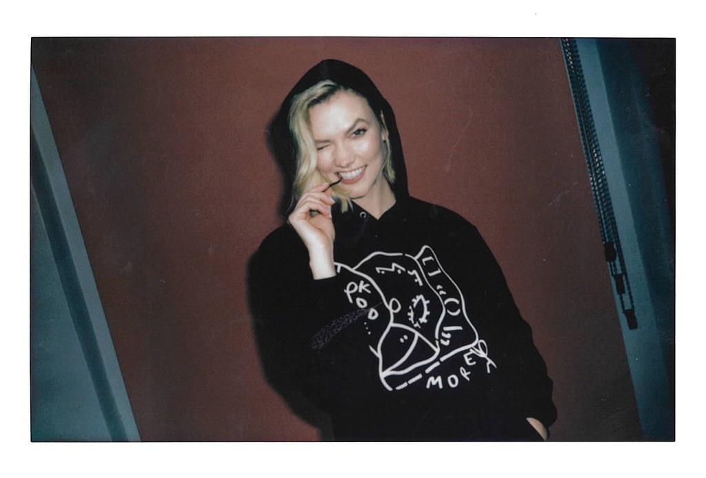

> Decoded JPEG, saved in PNG format.

---

## basic encoding 
[`sources`](encode-basic/)

> ***by the end of this tutorial, you should be able to:***
> * *encode a jpeg file using the baseline sequential coding process*
> * *understand and use chroma subsampling*
> * *define image layouts and sequential scan progressions*
> * *define basic huffman and quantization table relationships*
> * *use the parameterized quantization api to save images at different quality levels*

Encoding a JPEG file is somewhat more complex than decoding one due to the number of encoding options available. We’ll assume you have a pixel buffer containing the image you want to save as a JPEG, along with its dimensions, and the prefix of the file path you want to write it to. (As with the decoder, built-in file system support is only available on MacOS and Linux.)

```swift 
import JPEG 

let rgb:[JPEG.RGB]      = [ ... ] , 
    size:(x:Int, y:Int) = (400, 665)
let path:String         = "examples/encode-basic/karlie-milan-sp12-2011", 
```


> *Karlie Kloss at Milan Fashion Week Spring 2012, in 2011*
> 
> *(photo by John “hugo971”)*

To explore some of the possible encoding options, we will export images under varying **subsampling** schemes and quality levels. The outer loop will iterate through four different subsampling modes, which include human-readable suffixes that will go into the generated file names:

```swift 
for factor:(luminance:(x:Int, y:Int), chrominance:(x:Int, y:Int), name:String) in 
[
    ((1, 1), (1, 1), "4:4:4"),
    ((1, 2), (1, 1), "4:4:0"),
    ((2, 1), (1, 1), "4:2:2"),
    ((2, 2), (1, 1), "4:2:0"),
]
```

If you don’t know what subsampling is, or what the colon-separated notation means, it’s a way of encoding the grayscale and color channels of an image in different resolutions to save space. The first number in the colon-separated notation is always 4 and represents two rows of four luminance pixels; the second number represents the number of corresponding chrominance pixels in the first row, and the third number represents the number of corresponding chrominance pixels in the second row, or is 0 if there is no second row.

```
          Y                      Cb,Cr 
┏━━━━┱────┬────┬────┐    ┏━━━━┱────┬────┬────┐
┃    ┃    │    │    │    ┃    ┃    │    │    │
┡━━━━╃────┼────┼────┤ ←→ ┡━━━━╃────┼────┼────┤    4:4:4
│    │    │    │    │    │    │    │    │    │
└────┴────┴────┴────┘    └────┴────┴────┴────┘

┏━━━━┱────┬────┬────┐    ┏━━━━┱────┬────┬────┐
┃    ┃    │    │    │    ┃    ┃    │    │    │
┠────╂────┼────┼────┤ ←→ ┃    ┃    │    │    │    4:4:0
┃    ┃    │    │    │    ┃    ┃    │    │    │
┗━━━━┹────┴────┴────┘    ┗━━━━┹────┴────┴────┘

┏━━━━┯━━━━┱────┬────┐    ┏━━━━━━━━━┱─────────┐
┃    │    ┃    │    │    ┃         ┃         │
┡━━━━┿━━━━╃────┼────┤ ←→ ┡━━━━━━━━━╃─────────┤    4:2:2
│    │    │    │    │    │         │         │
└────┴────┴────┴────┘    └─────────┴─────────┘

┏━━━━┯━━━━┱────┬────┐    ┏━━━━━━━━━┱─────────┐
┃    │    ┃    │    │    ┃         ┃         │
┠────┼────╂────┼────┤ ←→ ┃         ┃         │    4:2:0
┃    │    ┃    │    │    ┃         ┃         │
┗━━━━┷━━━━┹────┴────┘    ┗━━━━━━━━━┹─────────┘
```

The sampling factors are alternative ways of expressing these configurations, indicating the number of samples in a **minimum coded unit** (bolded line).

We will use these settings to initialize a [`JPEG.Layout`](https://kelvin13.github.io/jpeg/JPEG/Layout/) structure specifying the shape and scan progression of the JPEG file you want to output.

```swift 
let layout:JPEG.Layout<JPEG.Common> = .init(
    format:     .ycc8,
    process:    .baseline, 
    components: 
    [
        1: (factor: factor.luminance,   qi: 0 as JPEG.Table.Quantization.Key), 
        2: (factor: factor.chrominance, qi: 1 as JPEG.Table.Quantization.Key), 
        3: (factor: factor.chrominance, qi: 1 as JPEG.Table.Quantization.Key),
    ], 
    scans: 
    [
        .sequential((1, \.0, \.0)),
        .sequential((2, \.1, \.1), (3, \.1, \.1))
    ])
```

The [`JPEG.Common`](https://kelvin13.github.io/jpeg/JPEG/Common/) generic parameter is the same as the one that appeared in the [`JPEG.Data.Rectangular`](https://kelvin13.github.io/jpeg/JPEG/Data/Rectangular/) type in the [basic decoding](#basic-decoding) example. It is the type of the `format` argument which specifies the color format that you want to save the image in. The [`JPEG.Common`](https://kelvin13.github.io/jpeg/JPEG/Common/) enumeration has four cases:

* [`y8`](https://kelvin13.github.io/jpeg/JPEG/Common/y8/): (8-bit [grayscale](https://en.wikipedia.org/wiki/Grayscale), *Y*&nbsp;=&nbsp;1)
* [`ycc8`](https://kelvin13.github.io/jpeg/JPEG/Common/ycc8/): (8-bit [YCbCr](https://en.wikipedia.org/wiki/YCbCr), *Y*&nbsp;=&nbsp;1, *Cb*&nbsp;=&nbsp;2, *Cr*&nbsp;=&nbsp;3)
* [`nonconforming1x8(_:)`](https://kelvin13.github.io/jpeg/JPEG/Common/nonconforming1x8%28_:%29/): (8-bit [grayscale](https://en.wikipedia.org/wiki/Grayscale), non-conforming scalars)
* [`nonconforming3x8(_:_:_:)`](https://kelvin13.github.io/jpeg/JPEG/Common/nonconforming3x8%28_:_:_:%29/): (8-bit [YCbCr](https://en.wikipedia.org/wiki/YCbCr), non-conforming triplets)

The last two cases are not standard JPEG color formats, they are provided for compatibility with older, buggy JPEG encoders.

The `process` argument specifies the JPEG coding process we are going to use to encode the image. Here, we have set it to the [`baseline`](https://kelvin13.github.io/jpeg/JPEG/Process/baseline/) process, which all browsers and image viewers should be able to display.

The `components` argument takes a dictionary mapping [`JPEG.Component.Key`](https://kelvin13.github.io/jpeg/JPEG/Component/Key/)s to their sampling factors and [`JPEG.Table.Quantization.Key`](https://kelvin13.github.io/jpeg/JPEG/Table/Quantization/Key/)s. Both key types are [`ExpressibleByIntegerLiteral`](https://developer.apple.com/documentation/swift/expressiblebyintegerliteral)s, so we’ve written them with their integer values. (We need the `as` coercion for the quantization keys in this example because the compiler is having issues inferring the type context here.)

Because we are using the standard [`ycc8`](https://kelvin13.github.io/jpeg/JPEG/Common/ycc8/) color format, component **1** always represents the *Y* channel; component **2**, the *Cb* channel; and component **3**, the *Cr* channel. As long as we are using the [`ycc8`](https://kelvin13.github.io/jpeg/JPEG/Common/ycc8/) color format, the dictionary must consist of these three component keys. (The quantization table keys can be anything you want.)

The `scans` argument specifies the **scan progression** of the JPEG file, and takes an array of [`JPEG.Header.Scan`](https://kelvin13.github.io/jpeg/JPEG/Header/Scan/)s. Because we are using the [`baseline`](https://kelvin13.github.io/jpeg/JPEG/Process/baseline/) coding process, we can only use sequential scans, which we initialize using the [`sequential(...:)`](https://kelvin13.github.io/jpeg/JPEG/Header/Scan/sequential%28...:%29/) static constructor. Here, we have defined one single-component scan containing the luminance channel, and another two-component interleaved scan containing the two color channels.

The two [keypaths](https://developer.apple.com/documentation/swift/keypath) in each component tuple specify [huffman table](https://en.wikipedia.org/wiki/Huffman_coding) destinations (DC and AC, respectively); if the AC or DC selectors are the same for each component in a scan, then those components will share the same (AC or DC) huffman table. The interleaved color scan 

```
        .sequential((2, \.1, \.1), (3, \.1, \.1))
```

will use one shared DC table, and one shared AC tables (two tables total). If we specified it like this:

```
        .sequential((2, \.1, \.1), (3, \.0, \.0))
```

then the scan will use a separate DC and separate AC table for each component (four tables total). Using separate tables for each component may result in better compression.

There are four possible selectors for each table type (`\.0`, `\.1`, `\.2`, and `\.3`), but since we are using the [`baseline`](https://kelvin13.github.io/jpeg/JPEG/Process/baseline/) coding process, we are only allowed to use selectors `\.0` and `\.1`. (Other coding processes can use all four.)

Next, we initialize a [`JPEG.JFIF`](https://kelvin13.github.io/jpeg/JPEG/JFIF/) metadata record with some placeholder values.

```swift 
let jfif:JPEG.JFIF = .init(version: .v1_2, density: (1, 1, .centimeters))
```

This step is not really necessary, but some applications may expect [JFIF](https://en.wikipedia.org/wiki/JPEG_File_Interchange_Format) metadata to be present, so we fill out this record with some junk values anyway.

Finally, we combine the layout, metadata, and the image contents into a [`JPEG.Data.Rectangular`](https://kelvin13.github.io/jpeg/JPEG/Data/Rectangular/) structure.

```swift 
let image:JPEG.Data.Rectangular<JPEG.Common> = 
    .pack(size: size, layout: layout, metadata: [.jfif(jfif)], pixels: rgb)
```

The static [`pack(size:layout:metadata:pixels:)`](https://kelvin13.github.io/jpeg/JPEG/Data/Rectangular/pack%28size:layout:metadata:pixels:%29/) method is generic and can also take an array of native [`JPEG.YCbCr`](https://kelvin13.github.io/jpeg/JPEG/YCbCr/) pixels.

The next step is to specify the quantum values the encoder will use to compress each of the image components. JPEG has no concept of linear “quality”; the quantization table values are completely independent. Still, the framework provides the [`JPEG.CompressionLevel`](https://kelvin13.github.io/jpeg/JPEG/CompressionLevel/) APIs to generate quantum values from a single “quality” parameter.

```swift 
enum JPEG.CompressionLevel 
{
    case luminance(Double)
    case chrominance(Double)
    
    var quanta:[UInt16] 
    {
        get 
    }
}
```

The only difference between the [`luminance(_:)`](https://kelvin13.github.io/jpeg/JPEG/CompressionLevel/luminance%28_:%29/) and [`chrominance(_:)`](https://kelvin13.github.io/jpeg/JPEG/CompressionLevel/chrominance%28_:%29/) cases is that one produces quantum values optimized for the *Y* channel while the other produces values optimized for the *Cb* and *Cr* channels.

We then loop through different compression levels and use the [`compress(path:quanta:)`](https://kelvin13.github.io/jpeg/JPEG/Data/Rectangular/compress%28path:quanta:%29/) method to encode the files. The keys in the dictionary for the `quanta` argument must match the quantization table keys in the image layout.

```swift 
for level:Double in [0.0, 0.125, 0.25, 0.5, 1.0, 2.0, 4.0, 8.0] 
{
    try image.compress(path: "\(path)-\(factor.name)-\(level).jpg", quanta: 
    [
        0: JPEG.CompressionLevel.luminance(  level).quanta,
        1: JPEG.CompressionLevel.chrominance(level).quanta
    ])
}
```

This example program will generate 32 output images. For comparison, the PNG-encoded image is about 548&nbsp;KB in size.

***4:4:4 subsampling***

| *l* = 0.0  | *l* = 0.125 | *l* = 0.25 | *l* = 0.5 |
| ---------- | ----------- | ---------- | --------- |
| 365.772 KB | 136.063 KB  | 98.233 KB  | 66.457 KB |
||||

| *l* = 1.0 | *l* = 2.0 | *l* = 4.0 | *l* = 8.0 |
| --------- | --------- | --------- | --------- |
| 46.548 KB | 32.378 KB | 22.539 KB | 15.708 KB |  
|||||

***4:4:0 subsampling***

| *l* = 0.0  | *l* = 0.125 | *l* = 0.25 | *l* = 0.5 |
| ---------- | ----------- | ---------- | --------- |
| 290.606 KB | 116.300 KB  | 84.666 KB  | 58.284 KB | 
|||||

| *l* = 1.0 | *l* = 2.0 | *l* = 4.0 | *l* = 8.0 |
| --------- | --------- | --------- | --------- |
| 41.301 KB | 28.362 KB | 18.986 KB | 12.367 KB | 
|||||

***4:2:2 subsampling***

| *l* = 0.0  | *l* = 0.125 | *l* = 0.25 | *l* = 0.5 |
| ---------- | ----------- | ---------- | --------- |
| 288.929 KB | 116.683 KB  | 85.089 KB  | 58.816 KB |
|||||

| *l* = 1.0 | *l* = 2.0 | *l* = 4.0 | *l* = 8.0 |
| --------- | --------- | --------- | --------- |
| 41.759 KB | 28.694 KB | 19.173 KB | 12.463 KB | 
|||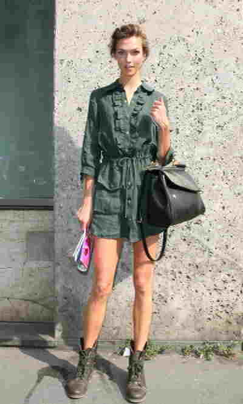|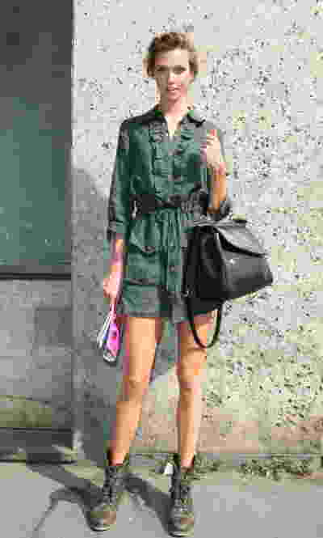|

***4:2:0 subsampling***

| *l* = 0.0  | *l* = 0.125 | *l* = 0.25 | *l* = 0.5 |
| ---------- | ----------- | ---------- | --------- |
| 247.604 KB | 106.800 KB  | 78.437 KB  | 54.693 KB |
|||||

| *l* = 1.0 | *l* = 2.0 | *l* = 4.0 | *l* = 8.0 |
| --------- | --------- | --------- | --------- |
| 38.912 KB | 26.466 KB | 17.299 KB | 10.744 KB | 
|||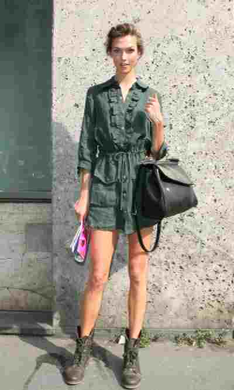|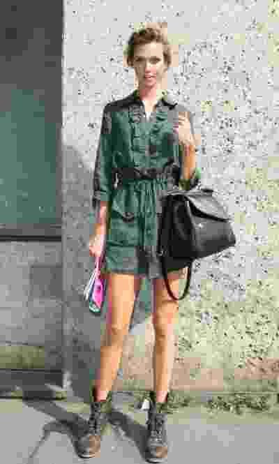|

---

## advanced decoding 

[`sources`](decode-advanced/)

> ***by the end of this tutorial, you should be able to:***
> * *use the multi-stage decompression api*
> * *read image sizes, metadata records, and layouts*
> * *understand the size metrics used by different data models*
> * *understand the difference between centered and cosited sampling*
> * *convert intra-data unit grid coordinates to zigzag indices*
> * *access values from a quantization table*

In the [basic decoding](#basic-decoding) tutorial, we used the single-stage [`decompress(path:cosite:)`](https://kelvin13.github.io/jpeg/JPEG/Data/Rectangular/decompress%28path:cosite:%29/) function to inflate a JPEG file from disk directly to its [`JPEG.Data.Rectangular`](https://kelvin13.github.io/jpeg/JPEG/Data/Rectangular/) representation. This time, we will decompress the file to an intermediate representation modeled by the [`JPEG.Data.Spectral`](https://kelvin13.github.io/jpeg/JPEG/Data/Spectral/) type.

```swift 
import JPEG 

let path:String = "examples/decode-advanced/karlie-2019.jpg"
guard let spectral:JPEG.Data.Spectral<JPEG.Common> = try .decompress(path: path)
else 
{
    fatalError("failed to open file '\(path)'")
}
```


> *Karlie Kloss leaving a [Cavs vs. Hornets basketball game](https://www.cleveland.com/cavs/2019/04/cleveland-cavaliers-end-season-with-124-97-loss-finish-with-fourth-worst-record-in-franchise-history-chris-fedors-instant-analysis.html) at [Rocket Mortgage FieldHouse](https://en.wikipedia.org/wiki/Rocket_Mortgage_FieldHouse) in 2019*
> 
> *(photo by Erik Drost)*

The spectral representation is the native representation of a JPEG image. That means that the image can be re-encoded from a [`JPEG.Data.Spectral`](https://kelvin13.github.io/jpeg/JPEG/Data/Spectral/) structure without any loss of information.

We can access the image’s pixel dimensions through the [`size`](https://kelvin13.github.io/jpeg/JPEG/Data/Spectral/size/) property, which returns a `(x:Int, y:Int)` tuple, and its layout through the [`layout`](https://kelvin13.github.io/jpeg/JPEG/Data/Spectral/layout/) property, which returns a [`JPEG.Layout`](https://kelvin13.github.io/jpeg/JPEG/Layout/) structure, the same type that we used in the [basic encoding](#basic-encoding) tutorial.

The [`JPEG.Layout`](https://kelvin13.github.io/jpeg/JPEG/Layout/) structure has the following members:

```swift 
struct JPEG.Layout<Format> where Format:JPEG.Format 
{
    // the color format of the image 
    let format:Format  
    // the coding process of the image 
    let process:JPEG.Process
    
    // a dictionary mapping each of the color components in the image 
    // to the index of the image plane storing it
    let residents:[JPEG.Component.Key: Int]
    
    // descriptors for each plane in the image 
    internal(set)
    var planes:[(component:JPEG.Component, qi:JPEG.Table.Quantization.Key)]
    // the sequence of scan and table declarations in the image 
    private(set)
    var definitions:[(quanta:[JPEG.Table.Quantization.Key], scans:[JPEG.Scan])]
}
```

We can print some of this information out like this:

```swift 
"""
'\(path)' (\(spectral.layout.format))
{
    size        : (\(spectral.size.x), \(spectral.size.y))
    process     : \(spectral.layout.process)
    precision   : \(spectral.layout.format.precision)
    components  : 
    [
        \(spectral.layout.residents.sorted(by: { $0.key < $1.key }).map 
        {
            let (component, qi):(JPEG.Component, JPEG.Table.Quantization.Key) = 
                spectral.layout.planes[$0.value]
            return "\($0.key): (\(component.factor.x), \(component.factor.y), qi: \(qi))"
        }.joined(separator: "\n        "))
    ]
    scans       : 
    [
        \(spectral.layout.scans.map 
        {
            "[band: \($0.band), bits: \($0.bits)]: \($0.components.map(\.ci))"
        }.joined(separator: "\n        "))
    ]
}
"""
```

```
'examples/decode-advanced/karlie-2019.jpg' (ycc8)
{
    size        : (640, 426)
    process     : baseline sequential DCT
    precision   : 8
    components  : 
    [
        [1]: (2, 2, qi: [0])
        [2]: (1, 1, qi: [1])
        [3]: (1, 1, qi: [1])
    ]
    scans       : 
    [
        [band: 0..<64, bits: 0..<9223372036854775807]: [[1], [2], [3]]
    ]
}

```

Here we can see that this image:

* is 640 pixels wide, and 426 pixels high,
* uses the baseline sequential coding process ,
* uses the 8-bit YCbCr color format, with standard component key assignments *Y*&nbsp;=&nbsp;**1**, *Cb*&nbsp;=&nbsp;**2**, and *Cr*&nbsp;=&nbsp;**3**,
* uses one quantization table (key **0**) for the *Y* component, and one (key **1**) for the *Cb* and *Cr* components,
* uses 4:2:0 chroma subsampling, and 
* has one sequential, interleaved scan encoding all three color components.

We can also read (and modify) the image metadata through the [`metadata`](https://kelvin13.github.io/jpeg/JPEG/Data/Spectral/metadata/) property, which stores an array of metadata records in the order in which they were encountered in the file. The metadata records are enumerations which come in four cases:

```swift 
enum JPEG.Metadata 
{
    case jfif       (JPEG.JFIF)
    case exif       (JPEG.EXIF)
    case application(Int, data:[UInt8])
    case comment    (data:[UInt8])
}
```

It should be noted that both JFIF and EXIF metadata segments are special types of [`application(_:data:)`](https://kelvin13.github.io/jpeg/JPEG/Metadata/application%28_:data:%29/) segments, with JFIF being equivalent to `application(0, data: ... )`, and EXIF being equivalent to `application(1, data: ... )`. The framework will only parse them as [`JPEG.JFIF`](https://kelvin13.github.io/jpeg/JPEG/JFIF/) or [`JPEG.EXIF`](https://kelvin13.github.io/jpeg/JPEG/EXIF/) if it encounters them at the very beginning of the JPEG file, and it will only parse one instance of each per file. This means that if for some reason, a JPEG file contains multiple JFIF segments (for example, to store a thumbnail), the latter segments will get parsed as regular [`application(_:data:)`](https://kelvin13.github.io/jpeg/JPEG/Metadata/application%28_:data:%29/) segments.

We can print out the JFIF, application, and comment segments like this: 

```swift 
for metadata:JPEG.Metadata in spectral.metadata
{
    switch metadata 
    {
    case .application(let a, data: let data):
        Swift.print("metadata (application \(a), \(data.count) bytes)")
    case .comment(data: let data):
        Swift.print("""
        comment 
        {
            '\(String.init(decoding: data, as: Unicode.UTF8.self))'
        }
        """)
    case .jfif(let jfif):
        Swift.print(jfif)
```

EXIF records can be extremely complex. The library will index the fields in an EXIF segment for you, but it won’t parse them. Nevertheless, it provides a number of APIs to make it easier for you to extract information from it, so long as you know what to look for, and how to parse it. For example, if we want to read the *Artist* field from the EXIF record, we can consult the [EXIF standard](https://www.exif.org/Exif2-2.PDF), which tells us that the **tag number** for that field is **315**. We can plug this identifier into the [`[tag:]`](https://kelvin13.github.io/jpeg/JPEG/EXIF/%5Btag:%5D/) subscript on the EXIF structure, to get the type, arity, and payload of the field, if it exists. We also verify that the type is indeed ASCII, as the standard expects. The standard tells us the *Artist* field is stored indirectly, so we interpret the payload as an offset, and attempt to read an ASCII string from that offset in the EXIF structure, using the typed [`[_:as:]`](https://kelvin13.github.io/jpeg/JPEG/EXIF/1383-%5B_:as:%5D/) subscript.

```swift 
    case .exif(let exif):
        print(exif)
        if  let (type, count, box):(JPEG.EXIF.FieldType, Int, JPEG.EXIF.Box) = exif[tag: 315],
            case .ascii = type
        {
            let artist:String = .init(decoding: (0 ..< count).map 
            {
                exif[box.asOffset + $0, as: UInt8.self]
            }, as: Unicode.ASCII.self)
            print("artist: \(artist)")
        }
}
```

> Note: The library does not support constructing or editing EXIF records. Because EXIF relies extensively on internal file pointers, it is easy to accidentally corrupt an EXIF segment. To perform more sophisticated EXIF operations, use a dedicated EXIF library, such as [Carpaccio](https://github.com/mz2/Carpaccio).

For our test image, this loop should produce the following output:

```
metadata (EXIF)
{
    endianness  : bigEndian
    storage     : 126 bytes 
}
artist: Erik Drost
metadata (application 2, 538 bytes)
```

We can see that this image contains an EXIF segment which uses big-endian byte order. (JPEG data is always big-endian, but EXIF data can be big-endian or little-endian.) It also contains a [Flashpix EXIF extension](https://en.wikipedia.org/wiki/Exif#FlashPix_extensions) segment, which shows up here as an unparsed 538-byte APP2 segment. Within the EXIF segment, we were able to read the photographer’s name: `'Erik Drost'`.

The `size`, `layout`, and `metadata` properties are available on all image representations, including [`JPEG.Data.Rectangular`](https://kelvin13.github.io/jpeg/JPEG/Data/Rectangular/), so you don’t need to go through this multistep decompression process to access them. However, the spectral representation is unique in that it also provides access to the quantization tables used by the image.

First we uniquify the quanta keys used by the all the planes in the image, since some planes may reference the same quantization table.

```swift 
let keys:Set<JPEG.Table.Quantization.Key> = .init(spectral.layout.planes.map(\.qi))
```

Then, for each of the quanta keys, we use the [`index(forKey:)`](https://kelvin13.github.io/jpeg/JPEG/Data/Spectral/Quanta/index%28forKey:%29/) method on the [`quanta`](https://kelvin13.github.io/jpeg/JPEG/Data/Spectral/quanta/) member of the [`JPEG.Data.Spectral`](https://kelvin13.github.io/jpeg/JPEG/Data/Spectral/) structure to obtain an integer index we can subscript the quanta storage with to get the table. (Accessing quantization tables with an index is a little more efficient than doing a new key lookup each time.)

```swift
let q:Int                           = spectral.quanta.index(forKey: qi) 
let table:JPEG.Table.Quantization   = spectral.quanta[q]

print("quantization table \(qi):")
```

The quantum values (and the spectral coefficients) are stored in a special **zigzag order**:

``` 
0    1    2    3    4    5    6    7    k
┏━━━━┱────┬────┬────┬────┬────┬────┬────┐  0
┃  0 →  1 │  5 →  6 │ 14 → 15 │ 27 → 28 │
┡━━━ ↙ ── ↗ ── ↙ ── ↗ ── ↙ ── ↗ ── ↙ ───┤  1
│  2 │  4 │  7 │ 13 │ 16 │ 26 │ 29 │ 42 │
├─ ↓ ↗ ── ↙ ── ↗ ── ↙ ── ↗ ── ↙ ── ↗ ↓ ─┤  2
│  3 │  8 │ 12 │ 17 │ 25 │ 30 │ 41 │ 43 │
├─── ↙ ── ↗ ── ↙ ── ↗ ── ↙ ── ↗ ── ↙ ───┤  3
│  9 │ 11 │ 18 │ 24 │ 31 │ 40 │ 44 │ 53 │
├─ ↓ ↗ ── ↙ ── ↗ ── ↙ ── ↗ ── ↙ ── ↗ ↓ ─┤  4
│ 10 │ 19 │ 23 │ 32 │ 39 │ 45 │ 52 │ 54 │
├─── ↙ ── ↗ ── ↙ ── ↗ ── ↙ ── ↗ ── ↙ ───┤  5
│ 20 │ 22 │ 33 │ 38 │ 46 │ 51 │ 55 │ 60 │
├─ ↓ ↗ ── ↙ ── ↗ ── ↙ ── ↗ ── ↙ ── ↗ ↓ ─┤  6
│ 21 │ 34 │ 37 │ 47 │ 50 │ 56 │ 59 │ 61 │
├─── ↙ ── ↗ ── ↙ ── ↗ ── ↙ ── ↗ ── ↙ ───┤  7
│ 35 → 36 │ 48 → 49 │ 57 → 58 │ 62 → 63 │
└────┴────┴────┴────┴────┴────┴────┴────┘  h
```

To obtain the zigzag coordinate from a 2D grid coordinate, you use the static [`JPEG.Table.Quantization.z(k:h:)`](https://kelvin13.github.io/jpeg/JPEG/Table/Quantization/z%28k:h:%29/) function, where `k` is the column index and `h` is the row index.

We can print out the quantum values as a matrix like this:

```swift 
extension String 
{
    static 
    func pad(_ string:String, left count:Int) -> Self 
    {
        .init(repeating: " ", count: count - string.count) + string
    }
}

"""
┌ \(String.init(repeating: " ", count: 4 * 8)) ┐
\((0 ..< 8).map 
{
    (h:Int) in 
    """
    │ \((0 ..< 8).map 
    {
        (k:Int) in 
        String.pad("\(table[z: JPEG.Table.Quantization.z(k: k, h: h)]) ", left: 4)
    }.joined()) │
    """
}.joined(separator: "\n"))
└ \(String.init(repeating: " ", count: 4 * 8)) ┘
"""
```

```
quantization table [0]:
┌                                  ┐
│   4   3   3   4   6  10  13  16  │
│   3   3   4   5   7  15  16  14  │
│   4   3   4   6  10  15  18  15  │
│   4   4   6   8  13  23  21  16  │
│   5   6  10  15  18  28  27  20  │
│   6   9  14  17  21  27  29  24  │
│  13  17  20  23  27  31  31  26  │
│  19  24  25  25  29  26  27  26  │
└                                  ┘
quantization table [1]:
┌                                  ┐
│   4   5   6  12  26  26  26  26  │
│   5   5   7  17  26  26  26  26  │
│   6   7  15  26  26  26  26  26  │
│  12  17  26  26  26  26  26  26  │
│  26  26  26  26  26  26  26  26  │
│  26  26  26  26  26  26  26  26  │
│  26  26  26  26  26  26  26  26  │
│  26  26  26  26  26  26  26  26  │
└                                  ┘
```

We can convert the spectral representation into a planar spatial representation, modeled by the [`JPEG.Data.Planar`](https://kelvin13.github.io/jpeg/JPEG/Data/Planar/) structure, using the [`idct()`](https://kelvin13.github.io/jpeg/JPEG/Data/Spectral/idct%28%29/) method. This function performs an **inverse frequency transform** (or **i**nverse **d**iscrete **c**osine **t**ransform) on the spectral data.

```swift
let planar:JPEG.Data.Planar<JPEG.Common> = spectral.idct()
```

The size of the planes in a [`JPEG.Data.Planar`](https://kelvin13.github.io/jpeg/JPEG/Data/Planar/) structure (and a [`JPEG.Data.Spectral`](https://kelvin13.github.io/jpeg/JPEG/Data/Spectral/) structure as well) always corresponds to a whole number of pixel blocks, which may not match the declared size of the image given by the `size` property. In addition, if the image uses chroma subsampling, the planes will not all be the same size.

Both [`JPEG.Data.Spectral`](https://kelvin13.github.io/jpeg/JPEG/Data/Spectral/) and [`JPEG.Data.Planar`](https://kelvin13.github.io/jpeg/JPEG/Data/Planar/) structures are `RandomAccessCollection`s of their `Plane` types. The `Plane` types provide 2D index iterators which traverse their index spaces in row-major order.

```swift 
for (p, plane):(Int, JPEG.Data.Planar<JPEG.Common>.Plane) in planar.enumerated()
{
    print("""
    plane \(p) 
    {
        size: (\(plane.size.x), \(plane.size.y))
    }
    """)
    
    let samples:[UInt8] = plane.indices.map 
    {
        (i:(x:Int, y:Int)) in 
        .init(clamping: plane[x: i.x, y: i.y])
    }
}
```

| *Y* component [**1**] |
| --------------------- | 
| 640x432 pixels        |
|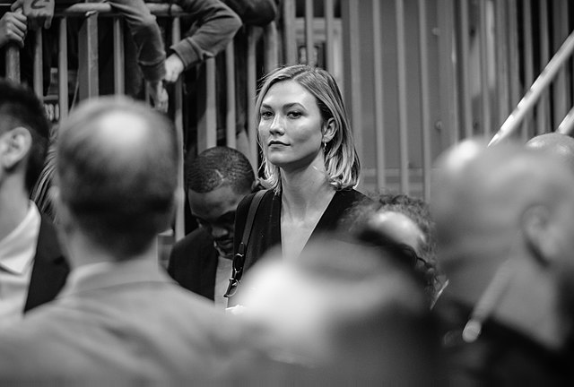|

| *Cb* component [**2**] |
| --------------------- | 
| 320x216 pixels        |
||

| *Cr* component [**3**] |
| --------------------- | 
| 320x216 pixels        |
||

The last step is to convert the planar representation into rectangular representation using the [`interleaved(cosite:)`](https://kelvin13.github.io/jpeg/JPEG/Data/Planar/interleaved%28cosite:%29/) method. **Cositing** refers to the positioning of color samples relative to the pixel grid. If samples are not cosited, then they are **centered**. The default setting is centered, meaning `cosite` is `false`.

```
        centered                             cosited 
     (cosite: false)                     (cosite: true)
┏━━━━━┱─────┬─────┬─────┐           ┏━━━━━┱─────┬─────┬─────┐
┃  ×  ┃  ×  │  ×  │  ×  │           ┃  ×  ┃  ×  │  ×  │  ×  │
┡━━━━━╃─────┼─────┼─────┤   4:4:4   ┡━━━━━╃─────┼─────┼─────┤
│  ×  │  ×  │  ×  │  ×  │           │  ×  │  ×  │  ×  │  ×  │
└─────┴─────┴─────┴─────┘           └─────┴─────┴─────┴─────┘

┏━━━━━┯━━━━━┱─────┬─────┐           ┏━━━━━┯━━━━━┱─────┬─────┐
┃  ·  ×  ·  ┃  ·  ×  ·  │           ┃  ×  │  ·  ┃  ×  │  ·  │
┡━━━━━┿━━━━━╃─────┼─────┤   4:2:2   ┡━━━━━┿━━━━━╃─────┼─────┤
│  ·  ×  ·  │  ·  ×  ·  │           │  ×  │  ·  │  ×  │  ·  │
└─────┴─────┴─────┴─────┘           └─────┴─────┴─────┴─────┘

┏━━━━━┯━━━━━┱─────┬─────┐           ┏━━━━━┯━━━━━┱─────┬─────┐
┃  ·  │  ·  ┃  ·  │  ·  │           ┃  ×  │  ·  ┃  ×  │  ·  │
┠──── × ────╂──── × ────┤   4:2:0   ┠─────┼─────╂─────┼─────┤
┃  ·  │  ·  ┃  ·  │  ·  │           ┃  ·  │  ·  ┃  ·  │  ·  │
┗━━━━━┷━━━━━┹─────┴─────┘           ┗━━━━━┷━━━━━┹─────┴─────┘

            luminance sample  ·
          chrominance sample  ×
```

In this example, we are using centered sampling to obtain the final pixel array.

```swift 
let rectangular:JPEG.Data.Rectangular<JPEG.Common> = planar.interleaved(cosite: false)
let rgb:[JPEG.RGB] = rectangular.unpack(as: JPEG.RGB.self)
```


> Decoded JPEG, saved in PNG format.

---

## advanced encoding  

[`sources`](encode-advanced/)

> ***by the end of this tutorial, you should be able to:***
> * *use custom quantization tables*
> * *use the multi-stage compression api*
> * *use the progressive coding process to encode images*
> * *define valid scan progressions for progressive images*
> * *view generated jpeg declarations and selector assignments*
> * *initialize various data models directly*

In this tutorial, we will use the same multi-stage API we used in the [advanced decoding](#advanced-decoding) tutorial, but in reverse. We will also use the progressive coding process to define a more sophisticated scan progression. As before, we will assume we have an input image, its pixel dimensions, and a file destination available.

```swift 
import JPEG 

let rgb:[JPEG.RGB]       = [ ... ] 
let path:String          = "examples/encode-advanced/karlie-cfdas-2011.png.rgb",
    size:(x:Int, y:Int)  = (600, 900)
```


> *Karlie Kloss at the 2011 [CFDA Fashion Awards](https://en.wikipedia.org/wiki/Council_of_Fashion_Designers_of_America#CFDA_Fashion_Awards) in New York City*
> 
> *(photo by John “hugo971”)*

To make the code a little more readable, we will give names to the three YCbCr component keys in the [`ycc8`](https://kelvin13.github.io/jpeg/JPEG/Common/ycc8/) format this image is going to use. The [`components`](https://kelvin13.github.io/jpeg/JPEG/Common/components/) property of the color format returns an array containing the component keys in the format, in canonical order.

```swift 
let format:JPEG.Common              = .ycc8
let Y:JPEG.Component.Key            = format.components[0],
    Cb:JPEG.Component.Key           = format.components[1],
    Cr:JPEG.Component.Key           = format.components[2]
```

Note that if the format case was [`y8`](https://kelvin13.github.io/jpeg/JPEG/Common/y8/), then we would only be able to subscript up to index `0`. There is also no guarantee that `components[0]` is the same in all cases, though for [`y8`](https://kelvin13.github.io/jpeg/JPEG/Common/y8/) and [`ycc8`](https://kelvin13.github.io/jpeg/JPEG/Common/ycc8/), they are.

We begin to initialize a [`JPEG.Layout`](https://kelvin13.github.io/jpeg/JPEG/Layout/) structure just as we did in the [basic encoding](#basic-encoding) tutorial, only this time we specify the [`progressive(coding:differential:)`](https://kelvin13.github.io/jpeg/JPEG/Process/progressive%28coding:differential:%29/) coding process. The only supported values for the `coding` and `differential` parameters are [`huffman`](https://kelvin13.github.io/jpeg/JPEG/Process/Coding/huffman/) and `false`, respectively, but they are defined because other library APIs can still recognize images using arithmetic ([`arithmetic`](https://kelvin13.github.io/jpeg/JPEG/Process/Coding/arithmetic/)) coding and hierarchical (differential) modes of operation.

```swift 
let layout:JPEG.Layout<JPEG.Common> = .init(
    format:     format,
    process:    .progressive(coding: .huffman, differential: false), 
    components: 
    [
        Y:  (factor: (2, 1), qi: 0), // 4:2:2 subsampling
        Cb: (factor: (1, 1), qi: 1), 
        Cr: (factor: (1, 1), qi: 1),
    ], 
```

The scan progression rules for progressive JPEGs are different than for sequential ([`baseline`](https://kelvin13.github.io/jpeg/JPEG/Process/baseline/) or [`extended(coding:differential:)`](https://kelvin13.github.io/jpeg/JPEG/Process/extended%28coding:differential:%29/)) JPEGs. A sequential scan encodes all bits (0 to infinity) of all coefficients (0 to 63) for each channel, and are always allowed to contain multiple channels. A progressive scan subsets bits in a process called **successive approximation**, and coefficients in a process called **spectral selection**. (In an analogy to signal processing, a coefficient subset is also called a **band**.) Only progressive scans which encode the DC coefficient only (band indices `0 ..< 1`) are allowed to encode multiple channels.

Progressive scans using successive approximation can be either **initial scans** or **refining scans**. An initial scan encodes all the bits from some starting index to infinity. A refining scan encodes a single bit. One valid successive approximation sequence is `(3..., 2 ..< 3, 1 ..< 2, 0 ..< 1)`, which contains one initial scan, and three refining scans. It is possible for there to be no refining scans, in which case, the initial scan will simply encode bits `0...`.

The progressive coding process is not backwards compatible with the sequential processes — progressive images always have to encode AC bands and the DC coefficient in separate scans, so a sequential scan, which contains coefficients 0 through 63, is not a valid progressive scan. It would have to be broken up into a scan encoding coefficient 0, and at least one scan encoding coefficients 1 through 63.

There are several more rules that have to be followed, or else the [`JPEG.Layout`](https://kelvin13.github.io/jpeg/JPEG/Layout/) initializer will suffer a [precondition failure](https://developer.apple.com/documentation/swift/1539374-preconditionfailure):

* The first scan for a particular component must be an initial DC scan, which can be interleaved with other components.
* Refining DC scans can be interleaved, but not refining AC scans.
* The initial scan encoding the high bits of any coefficient must come before any refining scans encoding bits in that coefficient.
* Refining scans must count downwards toward bit zero in increments of 1.
* No bit of any coefficient can be encoded twice.
* The total sampling volume (product of the sampling factors) of all the components in an interleaved scan cannot be greater than 10. This restriction does not apply to scans encoding a single component.

The following is an example of a valid scan progression, which we will be using in this tutorial:

```swift 
    scans: 
    [
        .progressive((Y,  \.0), (Cb, \.1), (Cr, \.1),  bits: 2...),
        .progressive( Y,         Cb,        Cr      ,  bit:  1   ),
        .progressive( Y,         Cb,        Cr      ,  bit:  0   ),
        
        .progressive((Y,  \.0),        band: 1 ..< 64, bits: 1...), 
        
        .progressive((Cb, \.0),        band: 1 ..<  6, bits: 1...), 
        .progressive((Cr, \.0),        band: 1 ..<  6, bits: 1...), 
        
        .progressive((Cb, \.0),        band: 6 ..< 64, bits: 1...), 
        .progressive((Cr, \.0),        band: 6 ..< 64, bits: 1...), 
        
        .progressive((Y,  \.0),        band: 1 ..< 64, bit:  0   ), 
        .progressive((Cb, \.0),        band: 1 ..< 64, bit:  0   ), 
        .progressive((Cr, \.0),        band: 1 ..< 64, bit:  0   ), 
    ])
```

The library provides four progressive scan header constructors:

1. [`progressive(...:bits:)`](https://kelvin13.github.io/jpeg/JPEG/Header/Scan/progressive%28...:bits:%29/)

 Returns an initial DC scan header. The variadic argument takes tuples of component keys and huffman table selectors; components with the same huffman table selector will share the same huffman table.

2. [`progressive(...:bit:)`](https://kelvin13.github.io/jpeg/JPEG/Header/Scan/progressive%28...:bit:%29/)

 Returns a refining DC scan header. The variadic argument takes scalar component keys with no huffman table selectors, because refining DC scans do not use entropy coding.

3. [`progressive(_:band:bits:)`](https://kelvin13.github.io/jpeg/JPEG/Header/Scan/progressive%28_:band:bits:%29/)

 Returns an initial AC scan header. For flexibility, you can specify the huffman table selector you want the scan in the encoded JPEG file to use, though this will have no discernable effect on image compression.

4. [`progressive(_:band:bit:)`](https://kelvin13.github.io/jpeg/JPEG/Header/Scan/progressive%28_:band:bit:%29/)

 Returns a refining AC scan header. The huffman table selector has the same significance that it does in the initial AC scan headers.

All the scan header constructors, including [`sequential(...:)`](https://kelvin13.github.io/jpeg/JPEG/Header/Scan/sequential%28...:%29/) return the same type, [`JPEG.Header.Scan`](https://kelvin13.github.io/jpeg/JPEG/Header/Scan/), but using a sequential constructor to define a scan for a progressive image will always produce an error.

When you initialize a layout, it will automatically assign quantization tables to table selectors and generate the sequence of JPEG declarations needed to associate the right table resources with the right scans. This can sometimes fail (with a fatal error) if the scan progression you provided requires more tables to be referenced at once than there are selectors for them to be attached to. The lifetime of a table extends from the first scan that contains a component using it, to the last scan containing such a component. (It does not have to be the same component.) 

Just as with the limits on the number of simultaneously referenced huffman tables, the [`baseline`](https://kelvin13.github.io/jpeg/JPEG/Process/baseline/) coding process allows for up to two simultaneously referenced quantization tables, while all other coding processes allow for up to four. In practice, since each component can only use one quantization table, the total number of quantization tables in a JPEG image can never exceed the number of components in the image, so these limitations are rarely encountered.

We can view the generated declarations and selector assignments with the following code: 

```swift 
for (tables, scans):([JPEG.Table.Quantization.Key], [JPEG.Scan]) in layout.definitions 
{
    print("""
    define quantization tables: 
    [
        \(tables.map(String.init(describing:)).joined(separator: "\n    "))
    ]
    """)
    print("""
    scans: \(scans.count) scans 
    """)
}

for (c, (component, qi)):(Int, (component:JPEG.Component, qi:JPEG.Table.Quantization.Key)) in 
    layout.planes.enumerated() 
{
    print("""
    plane \(c)
    {
        sampling factor         : (\(component.factor.x), \(component.factor.y))
        quantization table      : \(qi)
        quantization selector   : \\.\(String.init(selector: component.selector))
    }
    """)
}
```

```
define quantization tables: 
[
    [0]
    [1]
]
scans: 11 scans 
plane 0
{
    sampling factor         : (2, 1)
    quantization table      : [0]
    quantization selector   : \.0
}
plane 1
{
    sampling factor         : (1, 1)
    quantization table      : [1]
    quantization selector   : \.1
}
plane 2
{
    sampling factor         : (1, 1)
    quantization table      : [1]
    quantization selector   : \.1
}
```

Here we can see that the library has decided to define both quantization tables up front, with no need for additional declarations later on. Unsurprisingly, table **0** has been assigned to selector `\.0` and table **1** to selector `\.1`.

In the last encoding tutorial, we inserted a meaningless JFIF metadata segment into the encoded file; this time we will skip that and instead insert a JPEG comment segment.

```swift 
let comment:[UInt8] = .init("the way u say ‘important’ is important".utf8)
let rectangular:JPEG.Data.Rectangular<JPEG.Common> = 
    .pack(size: size, layout: layout, metadata: [.comment(data: comment)], pixels: rgb)
```

Here, we have stored a string encoded as [UTF-8](https://en.wikipedia.org/wiki/UTF-8) data into the comment body. The text encoding is irrelevant to JPEG, but many metadata viewers will display JPEG comments as UTF-8 text, so this is how we will store it.

When we created the rectangular data structure, we used the [`pack(size:layout:metadata:pixels:)`](https://kelvin13.github.io/jpeg/JPEG/Data/Rectangular/pack%28size:layout:metadata:pixels:%29/) constructor, but we could also have used the regular [`init(size:layout:metadata:values:)`](https://kelvin13.github.io/jpeg/JPEG/Data/Rectangular/init%28size:layout:metadata:values:%29/) initializer, which takes a `[UInt16]` array of (row-major) interleaved color samples. This initializer assumes you already have the image data stored in the right order and format, so it’s a somewhat lower-level API.

The next step is to convert the rectangular data into planar data. The method which returns the planar representation is the [`decomposed()`](https://kelvin13.github.io/jpeg/JPEG/Data/Rectangular/decomposed%28%29/) method.

```swift 
let planar:JPEG.Data.Planar<JPEG.Common> = rectangular.decomposed()
```

If the image layout uses subsampling, this method will downsample the image data with a basic box filter for the appropriate image planes. There is no concept of cositing or centering when downsampling, so this method takes no arguments. The box filter the library applies is a pretty bad low-pass filter, so it may be beneficial for you to implement your own subsampling filter and construct the planar data structure “manually” if you are trying to squeeze some extra quality into a subsampled JPEG. The [`init(size:layout:metadata:initializingWith:)`](https://kelvin13.github.io/jpeg/JPEG/Data/Planar/init%28size:layout:metadata:initializingWith:%29/) initializer can be used for this. It has the following signature:

```swift 
init(size:(x:Int, y:Int), 
    layout:JPEG.Layout<Format>, 
    metadata:[JPEG.Metadata], 
    initializingWith initializer:
    (Int, (x:Int, y:Int), (x:Int, y:Int), UnsafeMutableBufferPointer<UInt16>) throws -> ())
```

The first closure argument is the component index (also the plane index), the second closure argument is the dimensions of the plane in 8x8 unit blocks, the third closure argument is the sampling factor of the plane, and the last closure argument is the uninitialized (row-major) plane buffer. It stores 64*XY* elements, where (*X*,&nbsp;*Y*) are the dimensions of the plane in unit blocks.

The [`JPEG.Data.Planar`](https://kelvin13.github.io/jpeg/JPEG/Data/Planar/) type also has a plain [`init(size:layout:metadata:)`](https://kelvin13.github.io/jpeg/JPEG/Data/Planar/init%28size:layout:metadata:%29/) initializer with no data argument which initializes all planes to a neutral color. You can read and modify sample values through the 2D subscript [`[x:y:]`](https://kelvin13.github.io/jpeg/JPEG/Data/Planar/Plane/[x:y:]/) available on the plane type. 

To convert the planar data to spectral representation, we have to do a **forward frequency transform** (or **f**orward **d**iscrete **c**osine **t**ransform) using the [`fdct(quanta:)`](https://kelvin13.github.io/jpeg/JPEG/Data/Planar/fdct%28quanta:%29/) method. It is at this point where you have to provide the actual quantum values for each quantization table used in the image. In the [basic encoding](#basic-encoding) tutorial, we used the parameterized quality API to generate quantum values for us, but you can also specify the quanta yourself. Usually, it’s a good idea to pick smaller values for the earlier coefficients, and larger values for the later coefficients.

```swift 
let spectral:JPEG.Data.Spectral<JPEG.Common> = planar.fdct(quanta:     
    [
        0: [1, 2, 2, 3, 3, 3] + .init(repeating:  4, count: 58),
        1: [1, 2, 2, 5, 5, 5] + .init(repeating: 30, count: 58),
    ])
```

Like the [`JPEG.Data.Planar`](https://kelvin13.github.io/jpeg/JPEG/Data/Planar/) type, the [`JPEG.Data.Spectral`](https://kelvin13.github.io/jpeg/JPEG/Data/Spectral/) type has a plain [`init(size:layout:metadata:quanta:)`](https://kelvin13.github.io/jpeg/JPEG/Data/Spectral/init%28size:layout:metadata:quanta:%29/) initializer which initializes all coefficients to zero.
    
We can use the file system-aware compression API to encode the image and write it to disk.

```swift 
guard let _:Void = try spectral.compress(path: "\(path).jpg")
else 
{
    fatalError("failed to open file '\(path).jpg'")
}
```

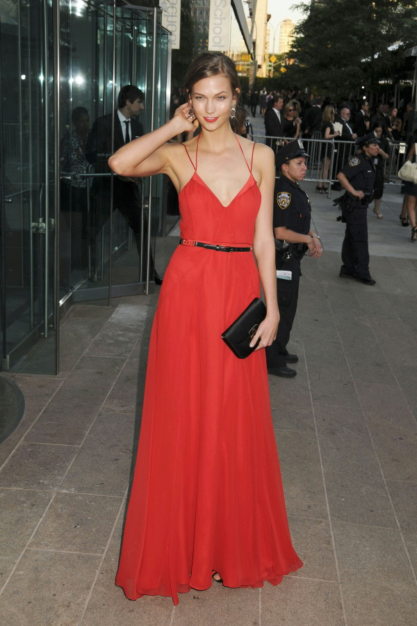

> Output JPEG, 189.8&nbsp;KB. (Original RGB data was 1.6&nbsp;MB, PNG image was 805.7&nbsp;KB.)

--- 

## using in-memory images 

[`sources`](in-memory/)

> ***by the end of this tutorial, you should be able to:***
> * *decode a jpeg image from a memory blob*
> * *encode a jpeg image into a memory blob*
> * *implement a custom data source or destination*

Up to this point we have been using the built-in file system-based API that the library provides on Linux and MacOS platforms. These APIs are built atop of the library’s core data stream APIs, which are available on all Swift platforms. (The core library is universally portable because it is written in pure Swift, with no dependencies, even [Foundation](https://developer.apple.com/documentation/foundation).) In this tutorial, we will use this lower-level interface to implement reading and writing JPEG files in memory.

Our basic data type modeling a memory blob is incredibly simple; it consists of a Swift array containing the data buffer, and a file position pointer in the form of an integer. Here, we have namespaced it under the libary’s [`System`](https://kelvin13.github.io/jpeg/System/) namespace to parallel the built-in file system APIs. 

```swift 
import JPEG 

extension System 
{
    struct Blob 
    {
        private(set)
        var data:[UInt8], 
            position:Int 
    }
}
```

There are two protocols a custom data stream type can support: [`JPEG.Bytestream.Source`](https://kelvin13.github.io/jpeg/JPEG/Bytestream/Source/), and [`JPEG.Bytestream.Destination`](https://kelvin13.github.io/jpeg/JPEG/Bytestream/Destination/). The first one enables image decoding, while the second one enables image encoding. We can conform to both with the following implementations:

```swift 
extension System.Blob:JPEG.Bytestream.Source, JPEG.Bytestream.Destination 
{
    init(_ data:[UInt8]) 
    {
        self.data       = data 
        self.position   = data.startIndex
    }
    
    mutating 
    func read(count:Int) -> [UInt8]? 
    {
        guard self.position + count <= data.endIndex 
        else 
        {
            return nil 
        }
        
        defer 
        {
            self.position += count 
        }
        
        return .init(self.data[self.position ..< self.position + count])
    }
    
    mutating 
    func write(_ bytes:[UInt8]) -> Void? 
    {
        self.data.append(contentsOf: bytes) 
        return ()
    }
}
```

For the sake of tutorial brevity, we are not going to bother bootstrapping the task of obtaining the JPEG memory blob in the first place, so we will just use the built-in file system API for this. But we could have gotten the data any other way.

```swift 
let path:String         = "examples/in-memory/karlie-2011.jpg"
guard let data:[UInt8]  = (System.File.Source.open(path: path) 
{
    (source:inout System.File.Source) -> [UInt8]? in
    
    guard let count:Int = source.count
    else 
    {
        return nil 
    }
    return source.read(count: count)
} ?? nil)
else 
{
    fatalError("failed to open or read file '\(path)'")
}

var blob:System.Blob = .init(data)
```


> Karlie Kloss in 2011, unknown setting. 
>
> (photo by John “hugo971”)

To decode using our `System.Blob` type, we use the [`decompress(stream:)`](https://kelvin13.github.io/jpeg/JPEG/Data/Spectral/decompress%28stream:%29/) functions, which are part of the core library, and do essentially the same things as the file system-aware [`decompress(path:)`](https://kelvin13.github.io/jpeg/JPEG/Data/Spectral/decompress%28path:%29/) functions.

```swift 
let spectral:JPEG.Data.Spectral<JPEG.Common>    = try .decompress(stream: &blob)
let image:JPEG.Data.Rectangular<JPEG.Common>    = spectral.idct().interleaved()
let rgb:[JPEG.RGB]                              = image.unpack(as: JPEG.RGB.self)
```

Here, we have saved the intermediate [`JPEG.Data.Spectral`](https://kelvin13.github.io/jpeg/JPEG/Data/Spectral/) representation, because we will be using it later to encode the image back into an in-memory JPEG.


> Decoded JPEG, saved in PNG format.

Just as with the decompression APIs, the [`compress(path:)`](https://kelvin13.github.io/jpeg/JPEG/Data/Spectral/compress%28path:%29/)/[`compress(path:quanta:)`](https://kelvin13.github.io/jpeg/JPEG/Data/Rectangular/compress%28path:quanta:%29/) functions have generic [`compress(stream:)`](https://kelvin13.github.io/jpeg/JPEG/Data/Spectral/compress%28stream:%29/)/[`compress(stream:quanta:)`](https://kelvin13.github.io/jpeg/JPEG/Data/Rectangular/compress%28stream:quanta:%29/) versions. Here, we have cleared the blob storage, and written the spectral image we saved earlier to it:

```swift 
blob = .init([])
try spectral.compress(stream: &blob)
```

Then, we can save the blob to disk, to verify that the memory blob does indeed contain a valid JPEG file. 

```swift 
guard let _:Void = (System.File.Destination.open(path: "\(path).jpg")
{
    guard let _:Void = $0.write(blob.data)
    else 
    {
        fatalError("failed to write to file '\(path).jpg'")
    }
}) 
else
{
    fatalError("failed to open file '\(path).jpg'")
} 
```


> Re-encoded JPEG. Original file was 310.3&nbsp;KB; new file is 307.6&nbsp;KB, most likely due to differences in entropy coding.

---

## online decoding 

[`sources`](decode-online/)

> ***by the end of this tutorial, you should be able to:***
> * *use the contextual api to manually manage decoder state*
> * *display partially-downloaded progressive images*

Many applications using JPEG images transmit them to users over a network. In this use-case, it is often valuable for applications to be able to display a lower-quality preview of the image before it is fully downloaded onto a user’s device.

Some applications accomplish this by sending many copies of the same image at different resolutions, though this increases the total data that must be transferred. Alternatively, we can take advantage of the progressive JPEG coding process to display previews of partially downloaded JPEG images without data duplication. In this tutorial, we will implement a very rudimentary version of this, which will display partial “snapshots” of an image as successive scans arrive. Needless to say, for this to be worthwhile, we need the images to use the progressive coding process (not the baseline or extended processes). But assuming you control the server hosting the images you want to serve, you are probably already doing some preprocessing anyway.


> Karlie Kloss at the 2017 [Academy Awards](https://en.wikipedia.org/wiki/Academy_Awards). 
> 
> (photo by Walt Disney Television)

To mock up a file being transferred over a network, we are going to modify the blob type from the [last tutorial](#using-in-memory-images) by adding an integer field `available` representing the amount of the file we “have” at a given moment.

```swift 
import JPEG 

struct Stream  
{
    private(set)
    var data:[UInt8], 
        position:Int, 
        available:Int 
}
```

Each time we try to `read` from this stream, it will either return data from the available portion of the buffer, or it will return `nil` and “download” an additional 4&nbsp;KB of the file. We also allow for rewinding the current file position to an earlier state.

```swift 
extension Stream:JPEG.Bytestream.Source
{
    init(_ data:[UInt8]) 
    {
        self.data       = data 
        self.position   = data.startIndex
        self.available  = data.startIndex
    }
    
    mutating 
    func read(count:Int) -> [UInt8]? 
    {
        guard self.position + count <= data.endIndex 
        else 
        {
            return nil 
        }
        guard self.position + count < self.available 
        else 
        {
            self.available += 4096
            return nil 
        }
        
        defer 
        {
            self.position += count 
        }
        
        return .init(self.data[self.position ..< self.position + count])
    }
    
    mutating 
    func reset(position:Int) 
    {
        precondition(self.data.indices ~= position)
        self.position = position
    }
}
```

For the purposes of this tutorial we again initialize our mock data stream using the file system APIs, though we could just as easily imagine the data coming over an actual network.

```swift 
let path:String         = "examples/decode-online/karlie-oscars-2017.jpg"
guard let data:[UInt8]  = (System.File.Source.open(path: path) 
{
    (source:inout System.File.Source) -> [UInt8]? in
    
    guard let count:Int = source.count
    else 
    {
        return nil 
    }
    return source.read(count: count)
} ?? nil)
else 
{
    fatalError("failed to open or read file '\(path)'")
}

var stream:Stream = .init(data)
```

The key to making this work is understanding that, if the [`read(count:)`](https://kelvin13.github.io/jpeg/JPEG/Bytestream/Source/read%28count:%29/) call on the data stream returns `nil` (due to there not being enough data available), then one of four library errors will get thrown:

* [`JPEG.LexingError.truncatedMarkerSegmentType`](https://kelvin13.github.io/jpeg/JPEG/LexingError/truncatedMarkerSegmentType/)
* [`JPEG.LexingError.truncatedMarkerSegmentHeader`](https://kelvin13.github.io/jpeg/JPEG/LexingError/truncatedMarkerSegmentHeader/)
* [`JPEG.LexingError.truncatedMarkerSegmentBody(expected:)`](https://kelvin13.github.io/jpeg/JPEG/LexingError/truncatedMarkerSegmentBody%28expected:%29/)
* [`JPEG.LexingError.truncatedEntropyCodedSegment`](https://kelvin13.github.io/jpeg/JPEG/LexingError/truncatedEntropyCodedSegment/)

These errors get thrown from the library’s lexer functions, which lex JPEG marker and entropy-coded segments out of a raw bytestream. (The lexer functions are provided as extensions on the [`JPEG.Bytestream.Source`](https://kelvin13.github.io/jpeg/JPEG/Bytestream/Source/) protocol, so they are available on any conforming data stream type.)

```swift 
mutating 
func segment(prefix:Bool) throws -> ([UInt8], (JPEG.Marker, [UInt8]))

mutating 
func segment() throws -> (JPEG.Marker, [UInt8])
```

They are spelled this way because the high-level grammar of a JPEG file is essentially this:

```
JPEG                    ::= <Segment> * 
Segment                 ::= <Marker Segment> 
                          | <Prefixed Marker Segment>
Prefixed Marker Segment ::= <Entropy-Coded Segment> <Marker Segment> 

Entropy-Coded Segment   ::= data:[UInt8]
Marker Segment          ::= type:JPEG.Marker data:[UInt8]
```

The [`segment(prefix:)`](https://kelvin13.github.io/jpeg/JPEG/Bytestream/Source/segment%28prefix:%29/) method returns either a prefixed or regular marker segment; the [`segment()`](https://kelvin13.github.io/jpeg/JPEG/Bytestream/Source/segment%28%29/) method is a convenience method which always expects a regular marker segment with no prefixed entropy-coded segment.

To allow the lexing functions to recover on end-of-stream instead of crashing the application, we wrap them in the following `waitSegment(stream:)` and `waitSegmentPrefix(stream:)` functions, making sure to reset the file position if end-of-stream is encountered:

```swift 
func waitSegment(stream:inout Stream) throws -> (JPEG.Marker, [UInt8]) 
{
    let position:Int = stream.position
    while true 
    {
        do 
        {
            return try stream.segment()
        }
        catch JPEG.LexingError.truncatedMarkerSegmentType 
        {
            stream.reset(position: position)
            continue 
        }
        catch JPEG.LexingError.truncatedMarkerSegmentHeader 
        {
            stream.reset(position: position)
            continue 
        }
        catch JPEG.LexingError.truncatedMarkerSegmentBody 
        {
            stream.reset(position: position)
            continue 
        }
        catch JPEG.LexingError.truncatedEntropyCodedSegment 
        {
            stream.reset(position: position)
            continue 
        }
    }
}
func waitSegmentPrefix(stream:inout Stream) throws -> ([UInt8], (JPEG.Marker, [UInt8]))
{
    let position:Int = stream.position
    while true 
    {
        do 
        {
            return try stream.segment(prefix: true)
        }
        catch JPEG.LexingError.truncatedMarkerSegmentType 
        {
            stream.reset(position: position)
            continue 
        }
        catch JPEG.LexingError.truncatedMarkerSegmentHeader 
        {
            stream.reset(position: position)
            continue 
        }
        catch JPEG.LexingError.truncatedMarkerSegmentBody 
        {
            stream.reset(position: position)
            continue 
        }
        catch JPEG.LexingError.truncatedEntropyCodedSegment 
        {
            stream.reset(position: position)
            continue 
        }
    }
}
```

Because we are trying to interact with a decoded image while it is in an incomplete state, we have to take on the responsibility of managing decoder state ourselves. The basic rules that apply here are:

1. The first segment in a JPEG must be the **start-of-image** segment.
2. The last segment in a JPEG must be the **end-of-image** segment.
3. There is one **frame header** segment in a (non-hierarchical) JPEG, and it must come before any of the **scan header** segments.
4. A **scan header** segment is always followed by an **entropy-coded segment**.
5. A **restart** segment is always followed by an **entropy-coded segment**.
6. A **height redefinition** segment, if it appears in a JPEG, must come immediately after the last **entropy-coded segment** associated with the first scan. 
7. A **quantization table definition**, **huffman table definition**, or **restart interval definition** (not to be confused with a **restart** segment) can come anywhere in a JPEG, unless it would break rules 1, 2, 4, 5, or 6.

There are more rules relating to JFIF and EXIF metadata segments, but for simplicity, we will ignore all such segments. We will implement this in a function `decodeOnline(stream:_:)` which invokes its closure argument whenever a scan is fully encoded (that is, when rules 4 and 5 go out of scope).

```swift 
func decodeOnline(stream:inout Stream, _ capture:(JPEG.Data.Spectral<JPEG.Common>) throws -> ()) 
    throws
{
```

The first thing we do is lex the start-of-image segment:

```swift 
    var marker:(type:JPEG.Marker, data:[UInt8]) 

    // start of image 
    marker = try waitSegment(stream: &stream)
    guard case .start = marker.type 
    else 
    {
        fatalError()
    }
    marker = try waitSegment(stream: &stream)
```

The next section lexes segments in a loop, parsing and saving table and restart interval definitions, and exiting once it encounters and parses the frame header segment. Although we won’t do it here, the exit point of this loop is a good time for display applications to reserve visual space for the image, since the image width, and possibly the image height is known at this point.

```swift 
    var dc:[JPEG.Table.HuffmanDC]           = [], 
        ac:[JPEG.Table.HuffmanAC]           = [], 
        quanta:[JPEG.Table.Quantization]    = []
    var interval:JPEG.Header.RestartInterval?, 
        frame:JPEG.Header.Frame?
    definitions:
    while true 
    {
        switch marker.type 
        {
        case .frame(let process):
            frame   = try .parse(marker.data, process: process)
            marker  = try waitSegment(stream: &stream)
            break definitions
        
        case .quantization:
            let parsed:[JPEG.Table.Quantization] = 
                try JPEG.Table.parse(quantization: marker.data)
            quanta.append(contentsOf: parsed)
        
        case .huffman:
            let parsed:(dc:[JPEG.Table.HuffmanDC], ac:[JPEG.Table.HuffmanAC]) = 
                try JPEG.Table.parse(huffman: marker.data)
            dc.append(contentsOf: parsed.dc)
            ac.append(contentsOf: parsed.ac)
        
        case .interval:
            interval = try .parse(marker.data)
        
        // ignore 
        case .application, .comment:
            break 
        
        // unexpected 
        case .scan, .height, .end, .start, .restart:
            fatalError()
        
        // unsupported  
        case .arithmeticCodingCondition, .hierarchical, .expandReferenceComponents:
            break 
        }
        
        marker = try waitSegment(stream: &stream)
    }
```

Fortunately for us, the library provides the [`JPEG.Context`](https://kelvin13.github.io/jpeg/JPEG/Context/) state manager which will handle table selector bindings, restart intervals, scan progression validation, and other details. It also stores an instance of [`JPEG.Data.Spectral`](https://kelvin13.github.io/jpeg/JPEG/Data/Spectral/) and keeps it in a good state as we progressively build up the image. We can initialize the state manager once we have the frame header parsed:

```swift 
    // can use `!` here, previous loop cannot exit without initializing `frame`
    var context:JPEG.Context<JPEG.Common> = try .init(frame: frame!)
```

Then we can feed it all the definitions we saved from before encountering the frame header: 

```swift 
    for table:JPEG.Table.HuffmanDC in dc 
    {
        context.push(dc: table)
    }
    for table:JPEG.Table.HuffmanAC in ac 
    {
        context.push(ac: table)
    }
    for table:JPEG.Table.Quantization in quanta 
    {
        try context.push(quanta: table)
    }
    if let interval:JPEG.Header.RestartInterval = interval 
    {
        context.push(interval: interval)
    }
```

At this point, we are in the “body” of the JPEG file, and can proceed to parse and decode image scans. The first scan constitutes a special state, so we use a boolean flag to track this:

```swift 
    var first:Bool = true
    scans:
    while true 
    {
        switch marker.type 
        {
        // ignore 
        case .application, .comment:
            break 
        // unexpected
        case .frame, .start, .restart, .height:
            fatalError()
        // unsupported  
        case .arithmeticCodingCondition, .hierarchical, .expandReferenceComponents:
            break 
            
        case .quantization:
            for table:JPEG.Table.Quantization in 
                try JPEG.Table.parse(quantization: marker.data)
            {
                try context.push(quanta: table)
            }
        
        case .huffman:
            let parsed:(dc:[JPEG.Table.HuffmanDC], ac:[JPEG.Table.HuffmanAC]) = 
                try JPEG.Table.parse(huffman: marker.data)
            for table:JPEG.Table.HuffmanDC in parsed.dc 
            {
                context.push(dc: table)
            }
            for table:JPEG.Table.HuffmanAC in parsed.ac 
            {
                context.push(ac: table)
            }
        
        case .interval:
            context.push(interval: try .parse(marker.data))
```

The scan parsing looks more complex than it is. After parsing the scan header, it tries to lex out pairs of entropy-coded segments and marker segments, stopping if the marker segment is anything but a restart segment. 

```swift 
        case .scan:
            let scan:JPEG.Header.Scan   = try .parse(marker.data, 
                process: context.spectral.layout.process)
            var ecss:[[UInt8]] = []
            for index:Int in 0...
            {
                let ecs:[UInt8]
                (ecs, marker) = try waitSegmentPrefix(stream: &stream)
                ecss.append(ecs)
                guard case .restart(let phase) = marker.type
                else 
                {
```

The exit clause of the guard statement pushes the entropy-coded segments to the state manager, which invokes the decoder on them. The `extend` argument of the [`push(scan:ecss:extend:)`](https://kelvin13.github.io/jpeg/JPEG/Context/push%28scan:ecss:extend:%29/) method reflects the fact that the image height is not fully known at this point, which means that the image dimensions are flexible, and so can be *extend*ed.

```swift 
                    try context.push(scan: scan, ecss: ecss, extend: first)
```

If we had just decoded the first scan, then we look for a height redefinition segment immediately following it (rule 6). If it isn’t there, then we know the dimensions given in the frame header are real, and use that to construct a “virtual” height redefinition segment, which we then push to the state manager. This is a necessary step because the decoder could have extended the image vertically beyond its declared height while decoding image padding, so this padding needs to be trimmed off.

```swift 
                    if first 
                    {
                        let height:JPEG.Header.HeightRedefinition
                        if case .height = marker.type 
                        {
                            height = try .parse(marker.data)
                            marker = try waitSegment(stream: &stream)
                        }
                        // same guarantees for `!` as before
                        else if frame!.size.y > 0
                        {
                            height = .init(height: frame!.size.y)
                        }
                        else 
                        {
                            fatalError()
                        }
                        context.push(height: height)
                        first = false 
                    }
```

Then we print out some information about the scan for debugging purposes, invoke the closure argument, and validate the restart phase (if the guard statement did not exit the inner loop).

```swift 
                    print("band: \(scan.band), bits: \(scan.bits), components: \(scan.components.map(\.ci))")
                    try capture(context.spectral)
                    continue scans 
                }

                guard phase == index % 8 
                else 
                {
                    fatalError()
                }
            }
```

We exit the function when we encounter the end-of-image segment.

```swift 
        case .end:
            return
        }

        marker = try waitSegment(stream: &stream)
    }
}
```

Then we can invoke the `decodeOnline(stream:)` function like this:

```swift 
try decodeOnline(stream: &stream) 
{
    let image:JPEG.Data.Rectangular<JPEG.Common>    = $0.idct().interleaved()
    let rgb:[JPEG.RGB]                              = image.unpack(as: JPEG.RGB.self)
}
```

|       | scan                                     ||| image                               ||
| ----- | ---------- | ------- | ------------------- | -------------------------- | ------- | 
|       | band       | bit(s)  | components          | difference (50x) | current |
| **0** | `0 ..< 1`  | `1 ...` | **1**, **2**, **3** ||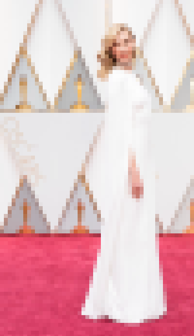|
| **1** | `1 ..< 6`  | `2 ...` | **1**               |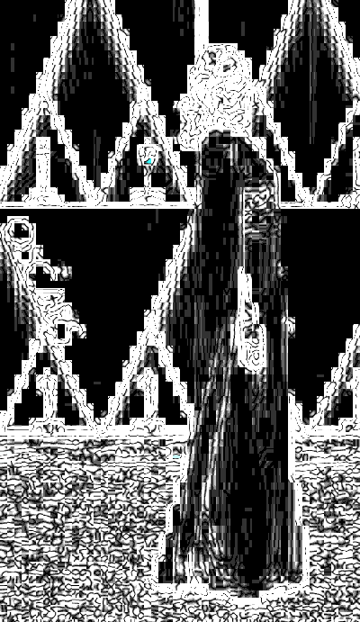||
| **2** | `1 ..< 64` | `1 ...` | **3**               |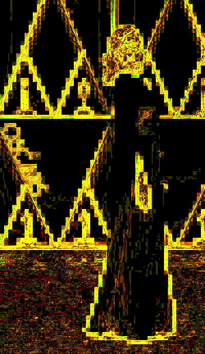||
| **3** | `1 ..< 64` | `1 ...` | **2**               |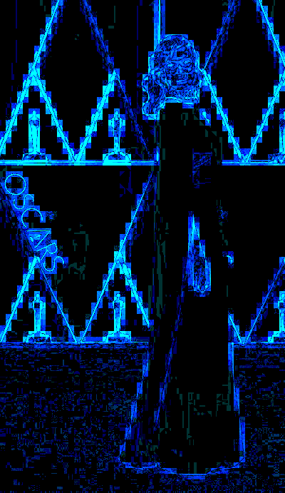||
| **4** | `6 ..< 64` | `2 ...` | **1**               |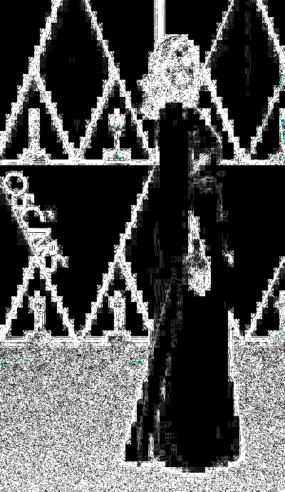||
| **5** | `1 ..< 64` | `1`     | **1**               |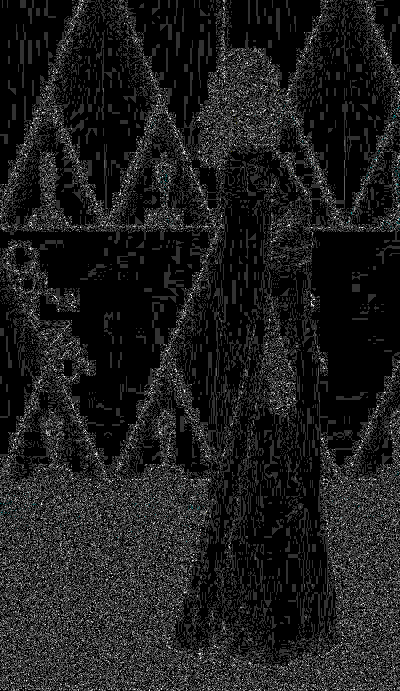||
| **6** | `0 ..< 1`  | `0`     | **1**, **2**, **3** |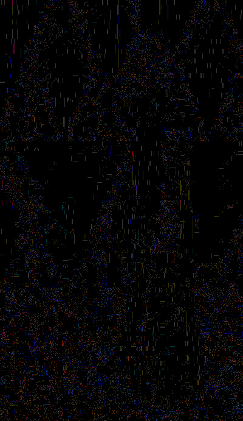||
| **7** | `1 ..< 64` | `0`     | **3**               |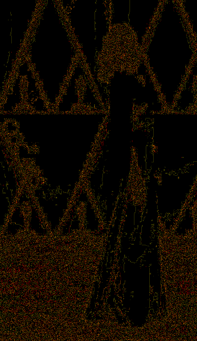||
| **8** | `1 ..< 64` | `0`     | **2**               |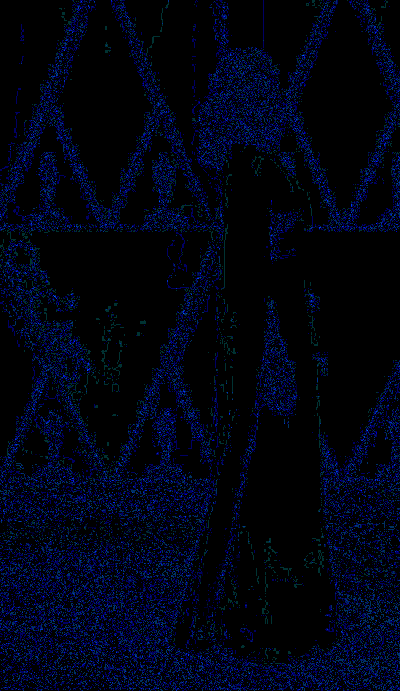||
| **9** | `1 ..< 64` | `0`     | **1**               |||

---

## requantizing images 

[`sources`](recompress/)

> ***by the end of this tutorial, you should be able to:***
> * *use the plane locking api to access spectral coefficients and quanta*
> * *manually quantize and dequantize spectral blocks*
> * *change the compression level of a jpeg with minimal information loss*

The concept of JPEG “quality” reflects the inherent tradeoff between visual fidelity and compression ratio. So what happens when you want to increase compresson by resaving a JPEG at a lower quality level?

What most people do is use an image editor to re-export the image with lower quality settings. While this can work, this is a *bad* way to adjust a JPEG’s compression level, since the image exporter ends up compressing the *noise* introduced by the last round of compression. When done repeatedly, this can actually *increase* file size relative to the amount of visual information retained in the file.

A better way to increase a JPEG’s compression level is to **requantize** the image in its spectral representation. This means rather than round-tripping the image all the way to its rectangular representation and back, we decode it to its spectral representation — at which point, no information has been lost — and then replace the old quantization tables with new quantization tables reflecting the new quality level we want to save the image with.

We already know how to decode a file to spectral representation, from the [advanced decoding](#advanced-decoding) tutorial:

```swift 
import JPEG

let path:String = "examples/recompress/original.jpg"
guard let original:JPEG.Data.Spectral<JPEG.Common> = try .decompress(path: path)
else 
{
    fatalError("failed to open file '\(path)'")
}
```


> Karlie Kloss advertising concept from Carolina Herrera’s [*Good Girl* perfume](https://www.carolinaherrera.com/us/en/fragrances/carolina-herrera-new-york/good-girl-2/) campaign. The rocket and moon base is a reference to STEM traditions in her fan base.
>
> ([image](https://twitter.com/karliekloss/status/1258889670357856257) from Karlie’s twitter account)

We can construct a progressive layout for our output image, just as we did in the [advanced encoding](#advanced-encoding) tutorial. Here we have used spectral selection, but no successive approximation:

```swift 
let format:JPEG.Common              = .ycc8
let Y:JPEG.Component.Key            = format.components[0],
    Cb:JPEG.Component.Key           = format.components[1],
    Cr:JPEG.Component.Key           = format.components[2]

let layout:JPEG.Layout<JPEG.Common> = .init(
    format:     format,
    process:    .progressive(coding: .huffman, differential: false), 
    components: original.layout.components, 
    scans: 
    [
        .progressive((Y,  \.0), (Cb, \.1), (Cr, \.1),  bits: 0...),
        
        .progressive((Y,  \.0),        band: 1 ..< 64, bits: 0...), 
        .progressive((Cb, \.0),        band: 1 ..< 64, bits: 0...), 
        .progressive((Cr, \.0),        band: 1 ..< 64, bits: 0...)
    ])
```

Next, we create an empty spectral image using the [`init(size:layout:metadata:quanta:)`](https://kelvin13.github.io/jpeg/JPEG/Data/Spectral/init%28size:layout:metadata:quanta:%29/) initializer. For the quantum values, we use the quanta from the original image, multiplied by 3, reflecting an increase in quantization, and therefore compression. We don’t scale the quantum for the DC coefficient, since posterizing the base colors of an image is a lot more noticable than dropping a few AC coefficients. It is important that we clamp the scaled quantum values to the range `0 ... 255`, since the [`ycc8`](https://kelvin13.github.io/jpeg/JPEG/Common/ycc8/) color format stores quantum values as 8-bit unsigned integers.

```swift 
var recompressed:JPEG.Data.Spectral<JPEG.Common> = .init(
    size:       original.size, 
    layout:     layout, 
    metadata:   
    [
        .jfif(.init(version: .v1_2, density: (1, 1, .centimeters))),
    ], 
    quanta: original.quanta.mapValues
    {
        [$0[0]] + $0.dropFirst().map{ min($0 * 3 as UInt16, 255) }
    })
```

We can use the [`read(ci:_:)`](https://kelvin13.github.io/jpeg/JPEG/Data/Spectral/read%28ci:_:%29/) method on the spectral image to access the spectral plane and its associated quantization table for its component key argument. The [`with(ci:_:)`](https://kelvin13.github.io/jpeg/JPEG/Data/Spectral/with%28ci:_:%29/) method does the same thing, except it allows you to mutate the plane coefficients. (It does not allow you to change the quantization tables — editing quantization tables by plane is a bad idea because doing so would affect all of the other planes using that quantization table.) 

```swift 
for ci:JPEG.Component.Key in recompressed.layout.recognized 
{
    original.read(ci: ci)
    {
        (plane:JPEG.Data.Spectral<JPEG.Common>.Plane, quanta:JPEG.Table.Quantization) in 
        
        recompressed.with(ci: ci) 
        {
```

We *could* access the planes and quanta by performing index lookups for the component and quantization keys, and then using the integer subscripts on `self` and [`quanta`](https://kelvin13.github.io/jpeg/JPEG/Data/Spectral/quanta/), but the [`read(ci:_:)`](https://kelvin13.github.io/jpeg/JPEG/Data/Spectral/read%28ci:_:%29/) and [`with(ci:_:)`](https://kelvin13.github.io/jpeg/JPEG/Data/Spectral/with%28ci:_:%29/) APIs provide a more convenient interface, with fewer spurious optionals. The [`JPEG.Data.Planar`](https://kelvin13.github.io/jpeg/JPEG/Data/Planar/) type also has [`read(ci:_:)`](https://kelvin13.github.io/jpeg/JPEG/Data/Planar/read%28ci:_:%29/) and [`with(ci:_:)`](https://kelvin13.github.io/jpeg/JPEG/Data/Planar/with%28ci:_:%29/) methods, but their closures don’t recieve quantization table arguments, since the coefficients have already been premultiplied in the planar representation.

Transferring the spectral data from the original image to the recompressed image is then a matter of iterating through the coefficient blocks, multiplying coefficients by the old quanta, and then dividing them by the new quanta.

```swift 
            for b:((x:Int, y:Int), (x:Int, y:Int)) in zip(plane.indices, $0.indices)
            {
                for z:Int in 0 ..< 64 
                {
                    let coefficient:Int16 = .init(quanta[z: z]) * plane[x: b.0.x, y: b.0.y, z: z]
                    let rescaled:Double   = .init(coefficient) / .init($1[z: z])
```

When writing the coefficients back to the recompressed image, we use a trick to improve the visual quality of the requantized image. An AC coefficient that has increased in magnitude is far more noticable than an AC coefficient that has gone missing, so we bias the coefficient rounding towards zero:

```swift 
                    $0[x: b.1.x, y: b.1.y, z: z] = .init(rescaled + (0.3 * (rescaled < 0 ? -1 : 1)))
```

This will also improve the compression ratio of the encoded image, since JPEGs encode zero coefficients very efficiently.

Then, we encode and save the image using the [`compress(path:)`](https://kelvin13.github.io/jpeg/JPEG/Data/Spectral/compress%28path:%29/) method:

```swift 
                }
            }
        }
    }
} 

try recompressed.compress(path: "examples/recompress/recompressed-requantized.jpg")
```

Compared with the output of an image editor used with quality settings chosen to produce a similarly-sized file, the requantized output is both smaller, and visually closer to the original:


> JPEG image, 12.2&nbsp;KB, resaved using [GIMP](https://www.gimp.org/), at quality 7, and with progressive encoding and JPEG optimization enabled.


> JPEG image, 11.2&nbsp;KB, resaved using our requantization implementation.

---

## lossless rotations 

[`sources`](rotate/)

> ***by the end of this tutorial, you should be able to:***
> * *use spectral identities to crop and rotate images losslessly*

In this tutorial, we will use the spectral image representation to implement lossless JPEG crops and rotations. Rotations in the frequency domain are composed out of three fundamental operations:

* transposition 
* horizontal reflection 
* vertical reflection 

A 90° counterclockwise rotation (quadrant II) is a transposition followed by a vertical reflection, or alternatively, a horizontal reflection followed by a transposition. A 90° clockwise rotation (quadrant IV) is a transposition followed by a horizontal reflection, or alternatively, a vertical reflection followed by a transposition. A 180° rotation (quadrant III) is a horizontal reflection and a vertical reflection, in any order.

In the frequency domain, a transposition is just that, a transposition. To do a horizontal reflection, you negate the odd columns of the coefficient matrix. To do a vertical reflection, you negate the odd rows of the coefficient matrix. (Reflections never affect the even frequencies, since they are [symmetric](https://en.wikipedia.org/wiki/Even_and_odd_functions).)

The coefficient mappings are simple enough that they could be hardcoded into an array literal. However, we can also generate them procedurally. Since none of the operations we are going to use mix coefficients, we can model a coefficient mapping with an source coefficient identifier *z* and a multiplier *s*. Because each coefficient has a unique zigzag index, we can use the zigzag index as a coefficient identifier. We store the multiplier as an `Int16`, since this is the type the coefficients themselves are stored as in a [`JPEG.Data.Spectral`](https://kelvin13.github.io/jpeg/JPEG/Data/Spectral/) image.

```swift 
import JPEG 

enum Block 
{
    typealias Coefficient = (z:Int, multiplier:Int16)
```

It is straightforward to express the three basic operations on a row-major matrix of coefficient mappings:

```swift 
    static 
    func transpose(_ input:[Coefficient]) -> [Coefficient]
    {
        (0 ..< 8).flatMap 
        {
            (y:Int) in 
            (0 ..< 8).map 
            {
                (x:Int) in 
                input[8 * x + y]
            }
        }
    }
    static 
    func reflectVertical(_ input:[Coefficient]) -> [Coefficient]
    {
        (0 ..< 8).flatMap 
        {
            (y:Int) -> [Coefficient] in 
            (0 ..< 8).map 
            {
                (x:Int) -> Coefficient in 
                (
                    input[8 * y + x].z, 
                    input[8 * y + x].multiplier * (1 - 2 * (.init(y) & 1))
                )
            }
        }
    }
    static 
    func reflectHorizontal(_ input:[Coefficient]) -> [Coefficient]
    {
        (0 ..< 8).flatMap 
        {
            (y:Int) -> [Coefficient] in 
            (0 ..< 8).map 
            {
                (x:Int) -> Coefficient in 
                (
                    input[8 * y + x].z, 
                    input[8 * y + x].multiplier * (1 - 2 * (.init(x) & 1))
                )
            }
        }
    }
```

We can define a static function `transform(_:)` that flattens a sequence of coefficient transformations into a single source-to-destination mapping. This function generates an identity mapping using [`JPEG.Table.Quantization.z(k:h:)`](https://kelvin13.github.io/jpeg/JPEG/Table/Quantization/z%28k:h:%29/), invokes the closure argument on the blank mapping, and then rearranges it into zigzag order so that the *z*th mapping in the resulting array indicates the source coefficient and multiplier for the *z*th coefficient in zigzag order.

```swift 
    static 
    func transform(_ body:([Coefficient]) -> [Coefficient]) -> [Coefficient]
    {
        let blank:[Coefficient] = (0 ..< 8).flatMap 
        {
            (y:Int) in 
            (0 ..< 8).map 
            {
                (x:Int) in 
                (JPEG.Table.Quantization.z(k: x, h: y), 1)
            }
        }
        let result:[Coefficient] = body(blank)
        let zigzag:[Coefficient] = .init(unsafeUninitializedCapacity: 64)
        {
            for h:Int in 0 ..< 8
            {
                for k:Int in 0 ..< 8 
                {
                    let z:Int   = JPEG.Table.Quantization.z(k: k, h: h)
                    $0[z]       = result[8 * h + k]
                }
            }
            $1 = 64
        }
        return zigzag
    }
```

Our rotation function, `rotate(_:input:output:)` will take a quadrant and two file paths as arguments, and open the input JPEG as a [`JPEG.Data.Spectral`](https://kelvin13.github.io/jpeg/JPEG/Data/Spectral/) image.


```swift 
enum Rotation:String
{
    case ii, iii, iv
}

func rotate(_ rotation:Rotation, input:String, output:String) throws 
{
    guard var original:JPEG.Data.Spectral<JPEG.Common> = try .decompress(path: input)
    else 
    {
        fatalError("failed to open file '\(input)'")
    } 
```


> Karlie Kloss with former *Teen Vogue* editor [Elaine Welteroth](https://en.wikipedia.org/wiki/Elaine_Welteroth), during [WWDC](https://en.wikipedia.org/wiki/Apple_Worldwide_Developers_Conference) 2017. Image is 89.8&nbsp;KB.
> 
> (photo from the Kode With Klossy official facebook)

Depending on the target quadrant, this function needs to pick:

* a coefficient mapping (*z*<sub>destination</sub>&nbsp;←&nbsp;*s*&nbsp;×&nbsp;*z*<sub>source</sub>), 
* a transformation matrix ((*x*<sub>destination</sub>,&nbsp;*y*<sub>destination</sub>)&nbsp;←&nbsp;(*x*<sub>source</sub>,&nbsp;*y*<sub>source</sub>)), and
* cropped image dimensions.

The last one is important because JPEG images only allow partial blocks on their bottom and right edges. If either of those edges would become a top or left edge after rotating, then that edge must be cropped to an integer multiple of the image’s minimum coded unit. The size of the minimum coded unit is the value of the [`scale`](https://kelvin13.github.io/jpeg/JPEG/Layout/scale/) property of the image layout, multiplied by 8.

```swift 
    let scale:(x:Int, y:Int) = original.layout.scale 

    let mapping:[Block.Coefficient]
    let matrix:(x:(x:Int, y:Int), y:(x:Int, y:Int))
    let size:(x:Int, y:Int)
```

To perform the crops, we use the mutating [`set(width:)`](https://kelvin13.github.io/jpeg/JPEG/Data/Spectral/set%28width:%29/) and [`set(height:)`](https://kelvin13.github.io/jpeg/JPEG/Data/Spectral/set%28height:%29/) methods on the spectral image. These methods can set the image dimensions to *any* value, but for the rotations to work correctly, we need to round the image dimensions down to a multiple of the minimum coded unit. Not all the rotations require both image dimensions to be cropped.

```swift 
    switch rotation 
    {
    case .ii:
        original.set(width:  original.size.x - original.size.x % (8 * scale.x))
        size = (original.size.y, original.size.x)
        mapping = Block.transform 
        {
            Block.reflectVertical(Block.transpose($0))
        }
        matrix  = 
        (
            ( 0,  1), 
            (-1,  0)
        )
        
    case .iii:
        original.set(width:  original.size.x - original.size.x % (8 * scale.x))
        original.set(height: original.size.y - original.size.y % (8 * scale.y))
        size = original.size 
        mapping = Block.transform 
        {
            Block.reflectVertical(Block.reflectHorizontal($0))
        }
        matrix  = 
        (
            (-1,  0), 
            ( 0, -1)
        )
    case .iv:
        original.set(height: original.size.y - original.size.y % (8 * scale.y))
        size = (original.size.y, original.size.x)
        mapping = Block.transform 
        {
            Block.reflectHorizontal(Block.transpose($0))
        }
        matrix  = 
        (
            ( 0, -1), 
            ( 1,  0)
        )
    }
```

We construct the output image, using the exact same layout as the original, but providing a new image size. We also rearrange the quantum values of the original quantization tables, to match the spectral rotation we are going to perform on the image data. (We cannot merge the multiplier values into the quantization tables, since quantum values are unsigned integers.)

```swift 
    var rotated:JPEG.Data.Spectral<JPEG.Common> = .init(
        size:       size, 
        layout:     original.layout, 
        metadata:   original.metadata, 
        quanta:     original.quanta.mapValues 
        {
            (old:[UInt16]) in 
            .init(unsafeUninitializedCapacity: 64)
            {
                for z:Int in 0 ..< 64 
                {
                    $0[z] = old[mapping[z].z]
                }
                
                $1 = 64
            }
        }) 
```

All of the coefficients in the output image were initialized to zero; to populate it with the transformed image data, we loop through every coefficient in every block of every plane. The index calculations are pretty straightforward to work out on paper, so we won’t go over them in detail.

```swift 
    // loop through planes 
    for p:(Int, Int) in zip(original.indices, rotated.indices)
    {
        let period:(x:Int, y:Int) = original[p.0].units
        let offset:(x:Int, y:Int) = 
        (
            (matrix.x.x < 0 ? period.x - 1 : 0) + (matrix.x.y < 0 ? period.y - 1 : 0),
            (matrix.y.x < 0 ? period.x - 1 : 0) + (matrix.y.y < 0 ? period.y - 1 : 0)
        )
        // loop through blocks 
        for s:(x:Int, y:Int) in original[p.0].indices 
        {
            let d:(x:Int, y:Int) = 
            (
                offset.x + matrix.x.x * s.x + matrix.x.y * s.y, 
                offset.y + matrix.y.x * s.x + matrix.y.y * s.y
            )
            
            // loop through coefficients 
            for z:Int in 0 ..< 64 
            {
                rotated[p.1][x: d.x, y: d.y, z: z] = 
                    original[p.0][x: s.x, y: s.y, z: mapping[z].z] * mapping[z].multiplier
            }
        }
    }
```

We write the output to disk using the [`compress(path:)`](https://kelvin13.github.io/jpeg/JPEG/Data/Spectral/compress%28path:%29/) method. 

```swift 
    guard let _:Void = try rotated.compress(path: output)
    else 
    {
        fatalError("failed to open file '\(output)'")
    } 
```


> Output JPEG, rotated 90°, 90.7&nbsp;KB.


> Output JPEG, rotated 180°, 88.2&nbsp;KB.


> Output JPEG, rotated 270°, 89.1&nbsp;KB.

---

## custom color formats 

[`sources`](custom-color/)

> ***by the end of this tutorial, you should be able to:***
> * *implement conforming custom color format types*
> * *implement conforming custom color target types*
> * *encode and decode deep-color images*

So far, we have only ever used image layouts with the built-in [`JPEG.Common`](https://kelvin13.github.io/jpeg/JPEG/Common/) type parameter. As you might expect from the generic nature of this API and other APIs, the library allows you to go beyond the 8-bit built-in YCbCr color formats and implement your own color formats. Subject to a few constraints, images using such custom color formats are compliant JPEG files, but are not compliant JFIF or EXIF images. Virtually no consumer image viewers support such JPEG images, but they can still be useful in medical and scientific applications that want to use specialized color formats, but still want to take advantage of JPEG compression. For example, some applications may want to augment a YCbCr image with an alpha or infrared channel, or use a completely different color space such as RGB. Other applications may want to increase the bit-depth to work with deep-color images.

In this tutorial, we will implement a custom 12-bit color format, `JPEG.Deep`, and define two color targets, `JPEG.RGB12` and `JPEG.RGBA12` that it can be used with. The `JPEG.Deep` format will have one case, `rgba12`, representing a 12-bit RGBA native format.

```swift 
import JPEG 

extension JPEG 
{
    enum Deep 
    {
        case rgba12
    }
    
    struct RGB12 
    {
        var r:UInt16
        var g:UInt16
        var b:UInt16
        
        init(_ r:UInt16, _ g:UInt16, _ b:UInt16)
        {
            self.r = r
            self.g = g
            self.b = b
        }
    }
    
    struct RGBA12 
    {
        var r:UInt16
        var g:UInt16
        var b:UInt16
        var a:UInt16
        
        init(_ r:UInt16, _ g:UInt16, _ b:UInt16, _ a:UInt16)
        {
            self.r = r
            self.g = g
            self.b = b
            self.a = a
        }
    }
}
```

To make these user-defined types work with the library APIs, we need to conform them to the [`JPEG.Format`](https://kelvin13.github.io/jpeg/JPEG/Format/) and [`JPEG.Color`](https://kelvin13.github.io/jpeg/JPEG/Color/) protocols, respectively. For the library to use a custom color format type, it must implement the following requirements:

```swift 
protocol JPEG.Format
{
    static 
    func recognize(_ components:Set<JPEG.Component.Key>, precision:Int) -> Self?
    
    // the ordering here is used to determine planar indices 
    var components:[JPEG.Component.Key]
    {
        get 
    }
    var precision:Int 
    {
        get 
    }
}
```

The static [`recognize(_:precision:)`](https://kelvin13.github.io/jpeg/JPEG/Format/recognize%28_:precision:%29/) function takes a set of component keys and a bit precision and returns an instance of `Self`, or `nil` if the arguments don’t match any case of this color format. (The arguments are assumed to have been read from a JPEG frame header.)

The [`components`](https://kelvin13.github.io/jpeg/JPEG/Format/components/) property returns an array containing the *recognized* components of the color format, in the same order that the planes of an image with a layout using this format would be arranged in. This does *not* have to be the same as the set of components passed to [`recognize(_:precision:)`](https://kelvin13.github.io/jpeg/JPEG/Format/recognize%28_:precision:%29/) constructor earlier, but it should be a subset of it. If the frame header declared components that don’t appear in this array, the decoder won’t allocate planes for them and will skip over those components when decoding scans. (This implies the decoder still expects those components to be present in the file.) Only components in this array will get encoded by the encoder.

The [`precision`](https://kelvin13.github.io/jpeg/JPEG/Format/precision/) property should return the same precision that was passed to the constructor; in other words, bit-depths in custom color formats should have read-write semantics.

We conform the `JPEG.Deep` type to [`JPEG.Format`](https://kelvin13.github.io/jpeg/JPEG/Format/) like this:

```swift 
extension JPEG.Deep:JPEG.Format 
{
    static 
    func recognize(_ components:Set<JPEG.Component.Key>, precision:Int) -> Self?
    {
        switch (components.sorted(), precision)
        {
        case ([4, 5, 6, 7], 12):
            return .rgba12 
        default:
            return nil 
        }
    }
    
    // the ordering here is used to determine planar indices 
    var components:[JPEG.Component.Key]
    {
        [4, 5, 6, 7]
    }
    var precision:Int 
    {
        12 
    }
}
```

Here, we have chosen to assign component keys **4**, **5**, **6**, and **7** to the red, green, blue, and alpha channels, respectively. We started the count from **4** to avoid conflicting with normal YCbCr JPEGs, which use the numbering **1**, **2**, and **3**.

The protocol supports a lot of flexibility, but the particular JPEG coding process used by an image limits the number of valid combinations. In particular:

* The baseline coding process only supports 8-bit color formats.
* The extended and progressive coding processes only support 8-bit and 12-bit color formats.
* The progressive coding process only supports color formats with up to four components.
* No coding process supports color formats with more than 255 components.

To implement a color target type for a particular color format type, we need to satisfy the following requirements:

```swift
protocol JPEG.Color
{
    associatedtype Format:JPEG.Format 
    
    static 
    func unpack(_ interleaved:[UInt16], of format:Format) -> [Self]
    static 
    func pack(_ pixels:[Self], as format:Format) -> [UInt16]
}
```

The static [`unpack(_:of:)`](https://kelvin13.github.io/jpeg/JPEG/Color/unpack%28_:of:%29/) and [`pack(_:as:)`](https://kelvin13.github.io/jpeg/JPEG/Color/pack%28_:as:%29/) provide the functionality for the [`unpack(as:)`](https://kelvin13.github.io/jpeg/JPEG/Data/Rectangular/unpack%28as:%29/) and [`pack(size:layout:metadata:pixels:)`](https://kelvin13.github.io/jpeg/JPEG/Data/Rectangular/pack%28size:layout:metadata:pixels:%29/) APIs. We conform our `JPEG.RGB12` and `JPEG.RGBA12` types like this:

```swift 
extension JPEG.RGB12:JPEG.Color 
{
    static 
    func unpack(_ interleaved:[UInt16], of format:JPEG.Deep) -> [Self]
    {
        switch format 
        {
        case .rgba12:
            return stride(from: interleaved.startIndex, to: interleaved.endIndex, by: 4).map 
            {
                (base:Int) -> Self in 
                .init(
                    interleaved[base    ], 
                    interleaved[base + 1], 
                    interleaved[base + 2])
            }
        }
    }
    static 
    func pack(_ pixels:[Self], as format:JPEG.Deep) -> [UInt16]
    {
        switch format 
        {
        case .rgba12:
            return pixels.flatMap
            {
                [min($0.r, 0x0fff), min($0.g, 0x0fff), min($0.b, 0x0fff), 0x0fff]
            }
        }
    }
}
extension JPEG.RGBA12:JPEG.Color 
{
    static 
    func unpack(_ interleaved:[UInt16], of format:JPEG.Deep) -> [Self]
    {
        switch format 
        {
        case .rgba12:
            return stride(from: interleaved.startIndex, to: interleaved.endIndex, by: 4).map 
            {
                (base:Int) -> Self in 
                .init(
                    interleaved[base    ], 
                    interleaved[base + 1], 
                    interleaved[base + 2], 
                    interleaved[base + 3])
            }
        }
    }
    static 
    func pack(_ pixels:[Self], as format:JPEG.Deep) -> [UInt16]
    {
        switch format 
        {
        case .rgba12:
            return pixels.flatMap
            {
                [min($0.r, 0x0fff), min($0.g, 0x0fff), min($0.b, 0x0fff), min($0.a, 0x0fff)]
            }
        }
    }
}
```

Here, we have the `JPEG.RGB12` type drop the alpha channel while unpacking and fill it with the maximum 12-bit integer value while packing. This is completely arbitrary; you can define whatever semantics you want here.

To create a test image, we can generate a procedural deep-color gradient using the `_sin(_:)` LLVM intrinsic like this:

```swift 
func sin(_ x:Double) -> UInt16 
{
    .init(0x0fff * (_sin(2.0 * .pi * x) * 0.5 + 0.5))
} 
let gradient:[JPEG.RGBA12] = stride(from: 0.0, to: 1.0, by: 0.005).flatMap 
{
    (phase:Double) in 
    stride(from: 0.0, to: 1.0, by: 0.001).map
    {
        .init(sin(phase + $0 - 0.15), sin(phase + $0), sin(phase + $0 + 0.15), 0x0fff)
    }
}
```

The code to construct the image layout, and encode the test image to disk should look familiar, only we have substituted our custom `JPEG.Deep` color format type for the usual [`JPEG.Common`](https://kelvin13.github.io/jpeg/JPEG/Common/) type:

```swift 
let format:JPEG.Deep     = .rgba12 
let R:JPEG.Component.Key = format.components[0],
    G:JPEG.Component.Key = format.components[1],
    B:JPEG.Component.Key = format.components[2],
    A:JPEG.Component.Key = format.components[3]

let layout:JPEG.Layout<JPEG.Deep> = .init(
    format:     format, 
    process:    .progressive(coding: .huffman, differential: false), 
    components: 
    [
        R: (factor: (2, 2), qi: 0),
        G: (factor: (2, 2), qi: 0),
        B: (factor: (2, 2), qi: 0),
        A: (factor: (1, 1), qi: 1),
    ], 
    scans: 
    [
        .progressive((G, \.0), (A, \.1),       bits: 0...),
        .progressive((R, \.0), (B, \.1),       bits: 0...),
        
        .progressive((R, \.0), band: 1 ..< 64, bits: 1...),
        .progressive((G, \.0), band: 1 ..< 64, bits: 1...),
        .progressive((B, \.0), band: 1 ..< 64, bits: 1...),
        .progressive((A, \.0), band: 1 ..< 64, bits: 1...),
        
        .progressive((R, \.0), band: 1 ..< 64, bit:  0),
        .progressive((G, \.0), band: 1 ..< 64, bit:  0),
        .progressive((B, \.0), band: 1 ..< 64, bit:  0),
        .progressive((A, \.0), band: 1 ..< 64, bit:  0),
    ])

let path:String                             = "examples/custom-color/output.jpg"
let image:JPEG.Data.Rectangular<JPEG.Deep>  = 
    .pack(size: (1000, 200), layout: layout, metadata: [], pixels: gradient)
try image.compress(path: path, quanta: 
[
    0: [1, 2, 2, 3, 3, 3] + .init(repeating:  10, count: 58),
    1: [1]                + .init(repeating: 100, count: 63),
])
```


> Output JPEG, 98.1&nbsp;KB. (Your browser or image viewer almost certainly can’t display this image.)

Note that the DC coefficients for the green and alpha channels have to go in a separate scan from the red and blue channels, because the four components together have a total sampling volume (13) greater than the limit of 10.

We can read this image back into our test program like this:

```swift 
guard let saved:JPEG.Data.Rectangular<JPEG.Deep> = try .decompress(path: path)
else 
{
    fatalError("failed to open file '\(path)'")
}

let rgb12:[JPEG.RGB12] = image.unpack(as: JPEG.RGB12.self)
```

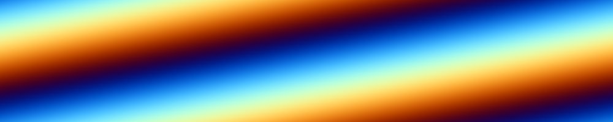

> Re-decoded deep-color image, saved as a 16-bit PNG, 15.2&nbsp;KB. The small file size relative to the JPEG file is because PNG’s [differential filtering](http://www.libpng.org/pub/png/spec/iso/index-object.html#4Concepts.EncodingFiltering) is extremely efficient at compressing linear gradients. ‘Real’ photographic data would compress much better as a JPEG than as a PNG.

To verify that this image really contains deep colors, we can difference it with an 8-bit truncated version of the same decoded data:


> Re-decoded deep-color image, saved as an 8-bit PNG, 5.8&nbsp;KB. 

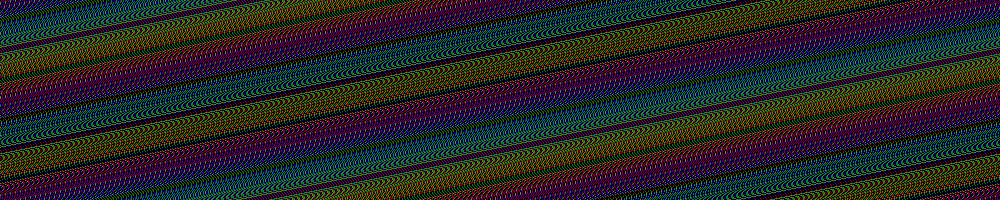

> Difference between 16-bit and 8-bit re-decoded images, amplified 128x.
